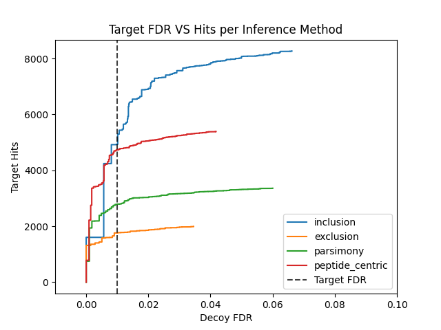


# Py Protein Inference
## Requirements

Current version: 0.8.0

 1. __Python 3.6__ or greater. This package was created using __Python 3.6__
 2. __Python Packages__:
	__numpy__, __pyteomics__, __pulp__, __PyYAML__, __matplotlib__. These should be installed automatically during installation.
		

## Installation
1. Use Pip:
```pip install pyproteininference```
2. Cloning the Repository:
```git clone repo_url``` - Replace repo_url with the proper URL for the package.
```cd repo``` - Replace repo with the name of the directory that protein inference was put into. Should be ```pyproteininference```
within the above directory type: ```python setup.py install```

After either of these two steps above the package should be installed


## Introduction
Py Protein Inference is an independent Python package that has the ability to run various protein inference algorithms on tandem mass spectrometry search results. In addition to performing protein inference which maps peptides to proteins, this algorithm creates protein scores based on the supplied peptides and is able to calculate set based protein level false discovery rates for MS data filtering purposes. Py Protein Inference typically takes as input the output PSM files from the [Percolator algorithm](https://github.com/percolator/percolator). However, Py Protein Inference can also take custom tab delimited files as input. As for output Py Protein Inference generates a user friendly tab delimited format that includes the Proteins, Peptides, Q values, and Protein Scores. 

 Py Protein Inference has the ability to run any of the following inference procedures from literature:

 1. Parsimony
 2. Exclusion
 3. Inclusion
 4. Peptide Centric (Protein Group Level)
 5. First Protein (Selects first protein per peptide)
 
 Please see the [__Inference Types__](#inference-types) section for more information on Inference Types
 
 In Addition to these inference types Py Protein Inference can also score proteins with a variety of methods:
 
 1. Best Peptide Per Protein
 2. Multiplicative Log
 3. Top Two Combined
 4. Additive
 5. Iterative Downweighted Log
 6. Downweighted Multiplicative Log
 7. Geometric Mean
 
Please see the [__Protein Score Types__](#protein-score-types) section for more information on scoring algorithms

## Using Py Protein Inference
Please go through each section below. The sections highlight how to set everything up properly to run Py Protein Inference and how to run an analysis with Py Protein Inference.
 1. [Yaml Parameter File](#yaml-parameter-file-outline)
 2. [Input PSM files](#input-file-examples) (Tab Delimited)
 3. [Fasta Database](#fasta-file-example)
 4. [Running Py Protein Inference](#running-py-protein-inference)

## Yaml Parameter File Outline
The Yaml Parameter File is the central location for all configurations for a given Protein Inference run and are summarized below:
For a sample parameter file please see the `parameters/` or `tests/data/` folder in the repository and look for `.yaml` files.
## General:
| Parameter | Description |Type|
|---|---|---|
| export | Export Type can be one of: __peptides__, __psms__, __psm_ids__, __long__, __q_value__, __q_value_all__, __q_value_comma_sep__, __leads__, __all__, __comma_sep__. Suggested types are __peptides__, __psms__, and __psm_ids__ as these produce square output. If there are mutliple proteins per group the three mentioned types will report the leads only. Other types report on the peptide level with slightly different formats and whether or not to include leads only or all proteins. See [here](#export-explanations) for an in-depth explanation of Export Types | String |
| fdr | False Discovery Rate to be marked as significant. Ex. __0.01__ for 1% FDR | Numeric |
| picker | __True__/__False__ on whether to run the Protein Picker algorithm. For more info click [here](#protein-picker) | Bool |
| tag | A String tag that will be written into the result files. Ex. __example_tag__ | String |

## Data Restriction:
| Parameter | Description |Type|
|---|---|---|
| pep_restriction | Posterior Error Probability values to filter. IE __0.9__. In this case PSMs with PEP values greater than __0.9__ would be removed from the input. If PEP values not in input please use __None__  | Numeric |
| peptide_length_restriction | Peptide Length to filter on. IE __7__. If no filter wanted please use __None__ | Int |
| q_value_restriction | Q Values to filter. IE __0.2__. In this case PSMs with Q Values greater than __0.2__ would be removed from the input. If Q Values not in input please use __None__  | Numeric |
| custom_restriction | Custom Value to filter. IE __5__. In this case PSMs with Custom value greater than / less than __5__ would be removed from the input. If Not using a custom score please use __None__. __NOTE__: If a higher score is "better" for your score please set __psm_score_type__ to __additive__. If a lower score is "better" please set __psm_score_type__ parameter to __multiplicative__   | Numeric |

## Score:
| Parameter | Description |Type|
|---|---|---|
| protein_score | One of any of the following: __multiplicative_log__, __best_peptide_per_protein__, __top_two_combined__, __additive__, __iterative_downweighted_log__, __downweighted_multiplicative_log__, __geometric_mean__. Recommended: __multiplicative_log__ | String |
| psm_score | PSM score to use for Protein Scoring. If using Percolator output as input this would either be __posterior_error_prob__ or __q-value__. The string typed here should match the column in your input files __EXACTLY__. If using a custom score it will be filtered accordingly with the value in [__custom_restriction__](#data-restriction) | String |
| psm_score_type | The Type of score that __psm_score__ parameter is. Either __multiplicative__ or __additive__. If a larger psm score is "better" than input additive IE (Mascot Ion Score, Xcorr, Percolator Score). If a smaller psm score is "better" than input multiplicative IE (Q Value, Posterior Error Probability). See [below](#extra-score-information) for more information| String |
#### Extra Score information:

 1. The __protein_score__, __psm_score__, and __psm_score_type__ methods must be compatible.
 2. If using a PSM score (__psm_score__ parameter) where the lower the score the better IE (__posterior_error_prob__ or __q-value__) then any  __protein_score__ can be used except __additive__. __psm_score_type__ must also be set to __multiplicative__
 3. If using a PSM score (__psm_score__ parameter) where the higher the score the better IE (Percolator Score, Mascot Ion Score, Xcorr) (Percolator Score is called __psm_score__ - column name) in the tab delimited percolator output. Then __protein_score__ and __psm_score_type__ must both be __additive__

## Identifiers:
| Parameter | Description |Type|
|---|---|---|
| decoy_symbol | Symbol within Decoy Identifiers to distinguish between targets. IE "__##__" or "__decoy___". This is important for Protein [Picker](#protein-picker) and FDR calculation | String |
| isoform_symbol | Symbol that is present in isoform proteins only. IE "__-__". See [below](#extra-identifier-information) for more information | String |
| reviewed_identifier_symbol | Identifier to determine a reviewed vs unreviewed identifier. IE "__sp\|__". See [below](#extra-identifier-information) for more information | String |
#### Extra Identifier information:

 1. For the __decoy_symbol__ an example of a target protein -> __ex|protein__ and its decoy counterpart could be any of the following: __##ex|##protein__, __##ex|protein__, __decoy_ex|protein__. The decoy symbol just needs to be present within the string to be determined decoy/target
 2. For __isoform_symbol__ and __reviewed_identifier_symbol__, these are used to assign priority in certain algorithms such as parsimony. For example if we have canonical proteins, isoform proteins, and reviewed/unreviewed proteins in a given analysis the priority would be established as followed: Reviewed Canonical, Reviewed Isoform, Unreviewed. What this means is that if two proteins map to the same peptides the algorithm has to make a decision on which to pick. It would use the previous mentioned priority to pick the protein lead to report. 

## Inference:
| Parameter | Description |Type|
|---|---|---|
| inference_type | The Inference procedure to apply to the analysis. This can be __parsimony__, __inclusion__, __exclusion__, __peptide_centric__, or __first_protein__. Please see [here](#inference-types) for more information on the inference types.  | String |
| grouping_type | How to group proteins for a given __inference_type__. This can be __subset_peptides__,  __shared_peptides__, or __None__. Typically __subset_peptides__ is used. This parameter only effects grouped proteins and has no impact on protein leads. | String |

## Digest:
| Parameter | Description |Type|
|---|---|---|
| digest_type | The enzyme used for digestion for the MS searches. IE 'trypsin'. Can be any expasy rule as defined here: https://pyteomics.readthedocs.io/en/latest/_modules/pyteomics/parser.html | String |
| missed_cleavages | The number of missed cleavages allowed for the MS searches. IE __2__ | Int |

## Parsimony:
These parameters are only used if __parsimony__ is selected as __inference_type__

| Parameter | Description |Type|
|---|---|---|
| lp_solver | This can be one of: __pulp__, __glpk__, __None__. This determines which linear program solver is used. Please see [here](#parsimony-dependancies) for more information on lp solvers. Both options have external dependency requirements. Input __None__ if not running __parsimony__ | String |
| glpk_path | If glpk is selected as __lp_solver__ input the path to the commandline tool __glpsol__. This is typically just __glpsol__ | String |
| shared_peptides | How to assign shared peptides for parsimony. Can be one of: __all__ or __best__. __all__ assigns shared peptides to all possible proteins in the output. __best__ assigns shared peptides to the best scoring protein which is a "winner take all" approach. This is specific to the Parsimony Inference type. | String |


## Peptide Centric:
These parameters are only used if __peptide_centric__ is selected as 

| Parameter | Description | Type |
|---|---|---|
| max_identifiers | The maximum number of proteins a peptide is allowed to map to. IE __5__. This serves to limit the number of protein groups that can be created due to highly homologous peptides. | Int |

## Input File Examples
As previously mentioned the standard input filetype is the tab delimited output from the percolator algorithm. Please see below for examples of input files:
#### Standard Percolator Output as Input
| PSMid | score | q-value | posterior_error_prob | peptide | proteinIds |  |  |  |
|---|---|---|---|---|---|---|---|---|
| 1.1 | 7.5 | 0.0048 | 0.0007 | R.NYIQSLTQMPK.M | MK14_HUMAN\|Q16539 | MK14_HUMAN\|Q16539-2 | MK14_HUMAN\|Q16539-3 |  |
| 1.2 | 6.2 | 0.0035 | 0.0006 | R.NTVASSSRSM*R.T | FHDC1_HUMAN\|Q9C0D6 |  |  |  |

With the above standard input one could use __q-value__ or __posterior_error_prob__ as the PSM score see [Score Section](#score) with __multiplicative__ as __psm_score_type__ and any of the multiplicative options for __protein_score__. Also, one could use __psm_score__ as the PSM __psm_score__ with __additive__ as the __psm_score_type__ and __protein_score__

For example standard input files please see any of the following:
`tests/data/test_perc_data_target.txt`
`tests/data/test_perc_data_decoy.txt`

#### Custom Input
| PSMid | custom_score | peptide | proteinIds |  | 
|---|---|---|---|---|
| 1.1 | 7.5 | R.NYIQSLTQMPK.M | MK14_HUMAN\|Q16539 | MK14_HUMAN\|Q16539-2 | MK14_HUMAN\|Q16539-3 |  |
| 1.2 | 6.2 |  R.NTVASSSRSM*R.T | FHDC1_HUMAN\|Q9C0D6 |  |  | 

With the above custom input one could use one could use __custom_score__ as the PSM __psm_score__ with __additive__ as the __psm_score_type__ and __protein_score__

For example custom input files please see any of the following:
`tests/data/test_perc_data_target_additive.txt`
`tests/data/test_perc_data_decoy_additive.txt`
`tests/data/test_perc_data_target_multiplicative.txt`
`tests/data/test_perc_data_decoy_multiplicative.txt`

## Fasta File Example
This package was developed using standard fasta files from [Uniprot](https://www.uniprot.org/).
Please see an example entry in a fasta database below:
```
>H2B2F_HUMAN|Q5QNW6-2 sp|H2B2F_HUMAN|Q5QNW6-2 Isoform 2 of Histone H2B type 2-F OS=Homo sapiens GN=HIST2H2BF
MPDPAKSAPAPKKGSKKAVTKVQKKDGKKRKRSRKESYSVYVYKVLKQVHPDTGISSKAM
GIMNSFVNDIFERIAGEASRLAHYNKRSTITSREIQTAVRLLLPGELAKHAVSEGTKAVT
KYTSSKLIGPILWK
```
Please see `tests/data/test_database.fasta` for an example fasta database file.

## Running Py Protein Inference
There are two ways to run Py Protein Inference:

 1. [__Command Line__](#running-via-command-line)
 2. [__Within Python__](#running-within-python)
 3. [__Docker__](#running-with-docker)
 4. [__Heuristic__](#running-heuristic)
### Running Via Command Line
Upon proper installation of the package, the command line tool should be installed and _should_ be available from any location on the system.
The command line tool can be called as follows:
`protein_inference_cli.py --help`
This will return the help prompt for the tool.
If this does not work download `protein_inference_cli.py` from our repository and write the full path to the script while also calling `python`
`python /path/to/directory/pyproteininference/scripts/protein_inference_cli.py --help`

Command line options are as follows:
```
cli$ python protein_inference_cli.py --help
usage: protein_inference_cli.py [-h] [-t FILE [FILE ...]] [-d FILE [FILE ...]] [-f FILE [FILE ...]] [-o DIR] [-l FILE] [-a DIR] [-b DIR] [-c DIR] [-db FILE] [-y FILE] [-p] [-i]

Protein Inference

optional arguments:
  -h, --help            show this help message and exit
  -t FILE [FILE ...], --target FILE [FILE ...]
                        Input target psm output from percolator. Can either input one file or a list of files.
  -d FILE [FILE ...], --decoy FILE [FILE ...]
                        Input decoy psm output from percolator. Can either input one file or a list of files.
  -f FILE [FILE ...], --combined_files FILE [FILE ...]
                        Input combined psm output from percolator. This should contain Target and Decoy PSMS. Can either input one file or a list of files.
  -o DIR, --output DIR  Result Directory to write to - Name of file will be determined by parameters selected and parameter tag. If this option is not set, will write results to current working
                        directory.
  -l FILE, --output_filename FILE
                        Filename to write results to. Can be left blank. If this flag is left blank the filename will be automatically generated. If set this flag will override -o.
  -a DIR, --target_directory DIR
                        Directory that contains either .txt or .tsv input target psm data. Make sure the directory ONLY contains result files.
  -b DIR, --decoy_directory DIR
                        Directory that contains either .txt or .tsv input decoy psm data. Make sure the directory ONLY contains result files.
  -c DIR, --combined_directory DIR
                        Directory that contains either .txt or .tsv input data with targets/decoys combined. Make sure the directory ONLY contains result files.
  -db FILE, --database FILE
                        Path to the fasta formatted database used in the MS search. This is optional. If not set, will use the proteins only in the input files.
  -y FILE, --yaml_params FILE
                        Path to a Protein Inference Yaml Parameter File. If this is not set, default parameters will be used.
  -p, --skip_append_alt
                        If this flag is set, will skip adding alternative proteins to each PSM from the database digest. If this flag is not set, the peptide/protein mapping will be taken from 
                        database digest and appended to the mapping present in the input files.
  -i, --id_splitting    If set this flag will split protein identifiers. See below for more information.If not set, this flag will not split protein identifiers.This flag indicates whether or not to
                        split the identifiers that are present in the fasta database. Only use this option if you know what you are doing. Sometimes the fasta database protein IDs will be like:
                        'sp|ARAF_HUMAN|P10398'. While protein IDs in the input files will be 'ARAF_HUMAN|P10398'. Setting This flag will split off the front 'sp|' or 'tr|' from the database protein
                        identifiers. This is typically not necessary. So leave this blank unless you know what you are doing.
```

The following flags are `"necessary"`:

1) `-db` Path to Fasta Database file (Technically this is optional but recommended if the peptide to protein map is not present in the input files)
2) `-y` Path to Protein Inference Yaml Parameter file (Required)
3) `-o` Output Directory is not necessary but if it is left blank files will be written to the current working directory
4) `-l` Output Filename is not necessary but if it is left blank a filename will be automatically generated and will be written to directory as set in `-o`. Will override `-o` flag it set.

The following combinations of input are allowed and at least one combination is required:

1) `-t -d` Path to input target (`-t`) and decoy (`-d`) files. This can be one target and one decoy file or multiple files separated by spaces (" ")
2) `-a -b` Path to input target (`-a`) and decoy (`-b`) directories that contain target and decoy files. This is one directory each and all .txt and .tsv files will be read in as input
3) `-f` Path to input combined target/decoy (`-f`) files. This can be one file file or multiple files separated by spaces (" ")
4) `-c` Path to input combined target/decoy (`-a`) directory that contain combined target/decoy files. This is one directory each and all .txt and .tsv files will be read in as input

Advanced usage flags

1) `-p` This flag is a True/False on whether or not to skip appending alternative proteins from the fasta database digestion. If this flag is left blank it will not skip appending alternative proteins. If a database is not supplied this flag does nothing. It is suggested to leave this flag blank unless you know what you are doing. Leaving this flag blank will append alternative proteins into the analysis from the fasta database.
2) `-i` True/False on whether or not to split the IDs in the fasta database file. Only use this flag if you know what you are doing. It typically should be left blank. See the help display above for more info. If it is left blank it will not split IDs in the fasta database file.

Any other combinations will result in an Error raised.
Please do not attempt to load separate target and decoy files with combined files. Also, do not load from directory as well as file as this is not supported.

If this works then you are ready to run the protein inference tool on your data.
You can run the tool as follows:
`protein_inference_cli.py -t /path/to/target/file.txt -d /path/to/decoy/file.txt -db /path/to/database/file.fasta -y /path/to/parameter/file.yaml -o /path/to/output/directory/`

Running with multiple input target/decoy files:
`protein_inference_cli.py -t /path/to/target/file1.txt /path/to/target/file2.txt -d /path/to/decoy/file1.txt /path/to/decoy/file2.txt -db /path/to/database/file.fasta -y /path/to/parameter/file.yaml -o /path/to/output/directory/`


### Running Within Python
To run within a python console please see the following example:
```python
from pyproteininference.pipeline import ProteinInferencePipeline

yaml_params = "/path/to/yaml/params.yaml"
database = "/path/to/database/file.fasta"
### target_files can either be a list of files or one file
target_files = ["/path/to/target1.txt","/path/to/target2.txt"]
### decoy_files can either be a list of files or one file
decoy_files = ["/path/to/decoy1.txt","/path/to/decoy2.txt"]
output_directory_name = "/path/to/output/directory/"

pipeline = ProteinInferencePipeline(parameter_file=yaml_params,
									database_file=database,  
                                    target_files=target_files,  
                                    decoy_files=decoy_files,  
                                    combined_files=None,  
                                    output_directory=output_directory_name)  
# Calling .execute() will initiate the pipeline with the given data                                                               
pipeline.execute()
```

### Running with Docker
Py Protein Inference can also be ran via a docker container. To access the docker container requires:
1. An Installation of Docker locally
2. Ability to pull the docker image from docker hub

Pulling the image from docker hub:
`docker pull pyproteininference:0.8.0`

It is recommended to pull the image with the highest version number. Currently this is 0.8.0.

Running via docker is similar to running normally on the commandline. One thing to consider is that you have to volume mount the data into the container.
Here we have data that exists in `/path/to/data/` locally and we are mounting it into a directory called `/data` within the container. Therefore, when running the tool in the container we sepcify all the paths of our data by using `/data` 
See the example below:
`docker run -v /path/to/data/:/data pyproteininference:0.8.0 python scripts/protein_inference_cli.py -t /data/target_file.txt -d /data/decoy_file.txt -db /data/database_file.fasta -y /data/parameter_file.yaml -o /data/`

#### Building the Docker image from source
Use the following command from the root directory of the source code:
Here we use version `0.8.0` and tag as that version as well.
`docker build . -f Dockerfile -t pyproteininference:0.8.0 --build-arg VERSION=0.8.0`

### Running Heuristic
Py Protein Inference also has a built in Heuristic that runs through four inference methods (Inclusion, Exclusion, Parsimony, and Peptide Centric) and selects a recommended method for your given dataset. 
The data from the recommended method will be written out to the output directory indicated by the user.
The Heuristic method also outputs a ROC plot that showcases all of the inference methods compared to one another to gain further insight. For more information on this Heuristic Method see the [__Heuristic__](#running-heuristic) section

#### Running the Heuristic Method via the Command Line
`python protein_inference_heuristic_cli.py --help`
This will return the help prompt for the tool.
If this does not work download `protein_inference_heuristic_cli.py` from our repository and write the full path to the script while also calling `python`
`python /path/to/directory/pyproteininference/scripts/protein_inference_heuristic_cli.py --help`

Command line options are as follows:
```
cli$ python protein_inference_heuristic_cli.py --help
usage: protein_inference_heuristic_cli.py [-h] [-t FILE [FILE ...]] [-d FILE [FILE ...]] [-f FILE [FILE ...]] [-o DIR] [-l FILE] [-a DIR] [-b DIR] [-c DIR] [-db FILE] [-y FILE] [-p] [-i] [-r FILE]
                                          [-m FLOAT]

Protein Inference Heuristic

optional arguments:
  -h, --help            show this help message and exit
  -t FILE [FILE ...], --target FILE [FILE ...]
                        Input target psm output from percolator. Can either input one file or a list of files.
  -d FILE [FILE ...], --decoy FILE [FILE ...]
                        Input decoy psm output from percolator. Can either input one file or a list of files.
  -f FILE [FILE ...], --combined_files FILE [FILE ...]
                        Input combined psm output from percolator. This should contain Target and Decoy PSMS. Can either input one file or a list of files.
  -o DIR, --output DIR  Result Directory to write to - Name of file will be determined by parameters selected and parameter tag. If this option is not set, will write results to current working
                        directory.
  -l FILE, --output_filename FILE
                        Filename to write results to. Can be left blank. If this flag is left blank the filename will be automatically generated. If set this flag will override -o.
  -a DIR, --target_directory DIR
                        Directory that contains either .txt or .tsv input target psm data. Make sure the directory ONLY contains result files.
  -b DIR, --decoy_directory DIR
                        Directory that contains either .txt or .tsv input decoy psm data. Make sure the directory ONLY contains. result files.
  -c DIR, --combined_directory DIR
                        Directory that contains either .txt or .tsv input data with targets/decoys combined. Make sure the directory ONLY contains result files.
  -db FILE, --database FILE
                        Path to the fasta formatted database used in the MS search. This is optional. If not set, will use the proteins only in the input files.
  -y FILE, --yaml_params FILE
                        Path to a Protein Inference Yaml Parameter File. If this is not set, default parameters will be used.
  -p, --skip_append_alt
                        If this flag is set, will skip adding alternative proteins to each PSM from the database digest. If this flag is not set, the peptide/protein mapping will be taken from 
                        database digest and appended to the mapping present in the input files.
  -i, --id_splitting    If set this flag will split protein identifiers. See below for more information.If not set, this flag will not split protein identifiers.This flag indicates whether or not to
                        split the identifiers that are present in the fasta database. Only use this option if you know what you are doing. Sometimes the fasta database protein IDs will be like:
                        'sp|ARAF_HUMAN|P10398'. While protein IDs in the input files will be 'ARAF_HUMAN|P10398'. Setting This flag will split off the front 'sp|' or 'tr|' from the database protein
                        identifiers. This is typically not necessary. So leave this blank unless you know what you are doing.
  -r FILE, --roc_plot_filepath FILE
                        PDF Filepath to write the ROC plot to after Heuristic Scoring. If not set, writes the file with filename roc_plot.pdf to directory set in -o. If -o is not set, will write the
                        file to current working directory.
  -m FLOAT, --fdr_max FLOAT
                        The maximum FDR to display in the ROC plot. Defaults to 0.1 if not set.
```

Input options are the same as the standard protein_inference_cli.py with the addition of two optional inputs:
1) `-r` This is a filepath that will have a pdf plot written to it after the heuristic method has been run. If this is left blank it will write the plot into the standard output directory with the name roc_plot.pdf
2) `-m` The maximum FDR to display in the ROC plot. If this value is left blank it will be set to 0.1

You can run the tool as follows:
`protein_inference_heuristic_cli.py -t /path/to/target/file.txt -d /path/to/decoy/file.txt -db /path/to/database/file.fasta -y /path/to/parameter/file.yaml -o /path/to/output/directory/ -r /path/to/pdf/file.pdf -m 0.2`

Running with multiple input target/decoy files:
`protein_inference_heuristic_cli.py -t /path/to/target/file1.txt /path/to/target/file2.txt -d /path/to/decoy/file1.txt /path/to/decoy/file2.txt -db /path/to/database/file.fasta -y /path/to/parameter/file.yaml -o /path/to/output/directory/ -r /path/to/pdf/file.pdf -m 0.2`


#### Running the Heuristic Method via Python
To run within a python console please see the following example:
```python
from pyproteininference.heuristic import HeuristicPipeline

yaml_params = "/path/to/yaml/params.yaml"
database = "/path/to/database/file.fasta"
### target_files can either be a list of files or one file
target_files = ["/path/to/target1.txt","/path/to/target2.txt"]
### decoy_files can either be a list of files or one file
decoy_files = ["/path/to/decoy1.txt","/path/to/decoy2.txt"]
output_directory_name = "/path/to/output/directory/"
pdf_filename = "/path/to/output/directory/roc_plot.pdf"

hp = HeuristicPipeline(parameter_file=yaml_params,
							 database_file=database,  
							 target_files=target_files,  
							 decoy_files=decoy_files,  
							 combined_files=None,  
							 output_directory=output_directory_name,
							 roc_plot_filepath=pdf_filename,
							 fdr_max=0.2)  
# Calling .execute() will initiate the heuristic pipeline with the given data 
# The suggested method will be output in the console and the suggested method results will be written into the output_directory
hp.execute()

# The ROC plot can be ran separately as well with the following:
hp.generate_roc_plot(fdr_max=0.1, pdf_filename=pdf_filename)
# Note, the above method can only be ran after .execute() has been run as well
```

#### Heuristic Output Example

##### Console Output
Console Output is as follows and indicates the recommended method at the end:
```
2021-07-22 17:43:05,677 - pyproteininference.heuristic.HeuristicPipeline - INFO - Number of Passing Proteins per Inference Method
2021-07-22 17:43:05,678 - pyproteininference.heuristic.HeuristicPipeline - INFO - {'inclusion': 4956, 'exclusion': 1769, 'parsimony': 2808, 'peptide_centric': 4757}
2021-07-22 17:43:05,679 - pyproteininference.heuristic.HeuristicPipeline - INFO - Initial Heuristic Scores
2021-07-22 17:43:05,679 - pyproteininference.heuristic.HeuristicPipeline - INFO - {'inclusion': 0.5928862224126847, 'exclusion': 0.576152064531587, 'parsimony': 0.2663299076815886, 'peptide_centric': 0.4970103849784959}
2021-07-22 17:43:05,679 - pyproteininference.heuristic.HeuristicPipeline - INFO - Removing inclusion with score 0.5928862224126847
2021-07-22 17:43:05,680 - pyproteininference.heuristic.HeuristicPipeline - INFO - Final Heuristic Scores
2021-07-22 17:43:05,680 - pyproteininference.heuristic.HeuristicPipeline - INFO - {'exclusion': 0.5323198942498348, 'parsimony': 0.1394422310756972, 'peptide_centric': 1.0786541402665502}
2021-07-22 17:43:05,680 - pyproteininference.heuristic.HeuristicPipeline - INFO - Removing exclusion with score 0.5323198942498348
2021-07-22 17:43:05,680 - pyproteininference.heuristic.HeuristicPipeline - INFO - Inference peptide_centric Selected with score 1.0786541402665502
```

##### ROC Plot Output
Below is an example of an ROC plot on some data. The plot indicates the number of target proteins identified at a specified decoy FDR for four methods (Inclusion, Exclusion, Parsimony, and Peptide Centric). 
The plot also indicates the Target FDR that is set in the parameter file. This Target FDR is also used by the heuristic in order to make decisions about the recommended inference method for the given dataset.



## Extra Information

### Heuristic Algorithm Notes
The Heuristic Algorithm contains multiple steps listed below:
1. First each of the four main inference methods is executed.
2. The number of Target proteins is identified for each inference method based on the target FDR found in the parameter file. This is usually 1% but can be changed by the user.
3. Similarity measurements are generated between all 4 methods. The similarity measurements are calculated by taking the number of target hits at the specified FDR of each method and dividing this number by the mean of the other 3 methods. This is done for all 4 methods.
4. The least similar method of the four is removed from further analysis.
5. The remaining methods are again checked against one another and step 3 is repeated for the 3 remaining methods
6. Inclusion/Exclusion are checked to see if they pass a certain threshold of similarity (This is empirically set to .2). Users can override this value by setting the value of `empirical_threshold` when running the method `determine_optimal_inference_method()` which is an instance method of the `HeuristicPipeline` Class. __Note__: This must be ran only after `execute()` has been ran on the data.
7. Using Empirical evidence a candidate method is selected based on the methods still available.

### Inference Types

#### Inclusion Notes

Inclusion simply maps all peptides to all possible proteins. In this model we allow peptides to map to multiple proteins.
This approach is useful if you want to analyze all possible proteins (even those that do not have any distinguishing peptides.)


#### Parsimony Notes

Parsimony is the process of taking the list of peptides and mapping them to the minimal set of protein identifiers avaliable. 
This is a standard method that is good at limiting the overall number of proteins but still utilizing all selected peptides.
This method allows shared peptides to map to more than one protein. Assuming that the proteins the peptides get mapped to also contain at least one unique peptide across the searches.


#### Exclusion Notes

Exclusion maps all peptides to all possible proteins but removes any peptide from the search that is not distinguishing. This means that if a peptide maps to more than one protein it will be removed. With this inference model the database selection is very important. Ideally the database selected for searches should have limited redundancy.
The redundancy is computed on the database level. IE if a peptide maps to more than one protein that is contained in the fasta database then that peptide will be removed from the analysis entirely.
Exception: If two or more proteins within the database map to the exact same set of digested peptides the algorithm will select the first listed protein and discard the others.


#### Peptide Centric Notes

For Peptide Centric inference all peptides are assigned to all possible proteins. Each peptide is then assigned a protein group based on the mentioned possible protein map. For protein group naming, the possible proteins for the peptides in the group are concatenated to a list separated by a semi-colon. 
This method is useful when there are a lot of shared peptides between multiple proteins. This will create new protein groups based on the shared peptides. This can sometimes more accurately represent the biological state.


#### First Protein Notes

For the First Protein inference method each peptide gets assigned to one protein only. The protein that gets assigned to each peptide is the first listed protein. This is typically the first protein listed in the fasta database file.
This method is useful if you just want a quick way to get a sense of the protein FDR and are not worried as much about the peptide to protein mapping.

### Parsimony Dependancies 
Parsimony currently has potential external dependancies depending on the __lp_solver__ that is selected in the parameter file.

 1. For __Pulp__:
	 Pulp _should_ automatically install the LP Solver CBC by default.
	 However, For troubleshooting please see [Pulp](https://pypi.org/project/PuLP/) documentation.
	 If Pulp is not working it is likely due to the linear program [CBC](https://github.com/coin-or/Cbc) not being installed.
	 Please follow the instructions for installing [CBC](https://github.com/coin-or/Cbc)
 2. For __Glpk__:
	 Mac: `brew install glpk` - Try to install with [Homebrew](https://brew.sh/)
	 Windows: Check [here](http://winglpk.sourceforge.net/)
	 Linux: Check [here](https://en.wikibooks.org/wiki/GLPK/Linux_packages)
	 Other: Check the main [GLPK website](https://www.gnu.org/software/glpk/)
	 Anaconda: [Anaconda](https://anaconda.org/conda-forge/glpk) also offers an installation
	 
### Protein Picker

[Protein Picker](https://www.ncbi.nlm.nih.gov/pubmed/25987413) is an algorithm that treats target and decoy proteins as pairs and is essentially target/decoy competition. If both the target and decoy proteins are identified from the searches when protein picker is ran the target and decoy scores are compared with one another. The one with the larger score is kept to continue on in the analysis while the one with the lower score gets filtered out of the analysis. This algorithm is integrated into other tools such as [Percolator Protein Inference](https://www.ncbi.nlm.nih.gov/pubmed/27572102)

### Protein Score Types

|Score Type| Description |
|---|---|
| Best Peptide Per Protein | Uses the best scoring PSM as the overall score for a given protein. This can be beneficial to use when proteins of interest map to few peptides |
| Multiplicative Log | Multiplies all of the PSM scores together and then takes the log of the value (This only works for scores where lower is better) |
| Top Two Combined | Takes the two best scoring peptides and applies Multiplicative Log to them to get the protein score |
| Additive | Adds all of the PSM scores together (This only works for scores where higher is better) |
| Downweighted Multiplicative Log | Multiplicative Log but normalizes by the number of PSMs per protein. This method attempts to normalize small and large proteins. In a typical multiplicative log a larger protein would have an advantage at having a higher score than a small protein |
| Geometric Mean | Takes the geometric mean of the PSMs per protein |

### Export explanations

It is advised to use the Standard Export Types OR __q_value__

#### Standard Export Types

All standard export types report back protein leads if there is protein subsetting from the specific tool. (Parsimony can provide protein subsets but in these export types we only choose to report the group lead).
The tables below represent what the output of each export type will look like. Exports are all of type CSV.

1. __peptide__: This is a standard export type that reports back Protein, Score, Qvalue, and Peptide sequences in a square format. By default peptide sequences are separated by a space " "

| Protein                 | Score              | Q_Value            | Number_of_Peptides | Identifier_Type | GroupID | Peptides                                                                                                                                                      | 
|-------------------------|--------------------|--------------------|--------------------|-----------------|---------|---------------------------------------------------------------------------------------------------------------------------------------------------------------| 
| RPOC_SHIF8\|Q0SY12      | 82.89306334778564  | 0.0                | 12                 | Reviewed        | 1       | CGVEVTQTK EGLNVLQY#FISTHGAR FATSDLNDLYR IALASPDMIR IPQESGGTK LIPAGTGYAYHQDR MGAEAIQALLK NTLLHEQWCDLLEENSVDAVK RVDYSGR VADLFEAR VIDIWAAANDR VTAEDVLKPGTADILVPR | 
| RAF1_HUMAN\|P04049      | 70.7434325345954   | 0.0                | 6                  | Reviewed        | 2       | CQTCGYKFHEHCSTK FQMFQLIDIAR QTAQGMDYLHAK SASEPSLHR VFLPNKQR WHGDVAVKILK                                                                                       | 
| ARAF_HUMAN\|P10398      | 46.288402190472596 | 0.0                | 4                  | Reviewed        | 3       | GYLSPDLSK QTAQGMDYLHAK SASEPSLHR TFFSLAFCDFCLK                                                                                                                | 
| TCAF1_HUMAN\|Q9Y4C2     | 19.048939464610452 | 0.0                | 2                  | Reviewed        | 4       | LYLLTQMPH YCWMSTGLYIPGR                                                                                                                                       | 
| HNRPU_HUMAN\|Q00839     | 15.316094065486292 | 0.0                | 2                  | Reviewed        | 5       | AEGGGGGGRPGAPAAGDGK LQAALDDEEAGGRPAMEPGNGSLDLGGDSAGR                                                                                                          | 
| ##TCAF2_HUMAN\|##A6NFQ2 | 2.4079456086518722 | 0.3333333333333333 | 1                  | Reviewed        | 6       | MEPTPVPFCGAK                                                                                                                                                  | 

2. __psms__: This is a standard export type that reports back Protein, Score, Qvalue, and PSMs in a square format. By default PSMs are separated by a space " "

| Protein                 | Score              | Q_Value            | Number_of_Peptides | Identifier_Type | GroupID | Peptides                                                                                                                                                      | 
|-------------------------|--------------------|--------------------|--------------------|-----------------|---------|---------------------------------------------------------------------------------------------------------------------------------------------------------------| 
| RPOC_SHIF8\|Q0SY12      | 82.89306334778564  | 0.0                | 12                 | Reviewed        | 1       | CGVEVTQTK EGLNVLQY#FISTHGAR FATSDLNDLYR IALASPDMIR IPQESGGTK LIPAGTGYAYHQDR MGAEAIQALLK NTLLHEQWCDLLEENSVDAVK RVDYSGR VADLFEAR VIDIWAAANDR VTAEDVLKPGTADILVPR | 
| RAF1_HUMAN\|P04049      | 70.7434325345954   | 0.0                | 6                  | Reviewed        | 2       | CQTCGYKFHEHCSTK FQMFQLIDIAR QTAQGMDYLHAK SASEPSLHR VFLPNKQR WHGDVAVKILK                                                                                       | 
| ARAF_HUMAN\|P10398      | 46.288402190472596 | 0.0                | 4                  | Reviewed        | 3       | GYLSPDLSK QTAQGMDYLHAK SASEPSLHR TFFSLAFCDFCLK                                                                                                                | 
| TCAF1_HUMAN\|Q9Y4C2     | 19.048939464610452 | 0.0                | 2                  | Reviewed        | 4       | LYLLTQMPH YCWMSTGLYIPGR                                                                                                                                       | 
| HNRPU_HUMAN\|Q00839     | 15.316094065486292 | 0.0                | 2                  | Reviewed        | 5       | AEGGGGGGRPGAPAAGDGK LQAALDDEEAGGRPAMEPGNGSLDLGGDSAGR                                                                                                          | 
| ##TCAF2_HUMAN\|##A6NFQ2 | 2.4079456086518722 | 0.3333333333333333 | 1                  | Reviewed        | 6       | MEPTPVPFCGAK                                                                                                                                                  | 

3 __psm_ids__: This is a standard export type that reports back Protein, Score, Qvalue, and PSM Identifiers in a square format. By default PSM IDs are separated by a space " ". Values in Peptides column will be the `PSMid` values from data input.

| Protein                 | Score              | Q_Value            | Number_of_Peptides | Identifier_Type | GroupID | Peptides                            | 
|-------------------------|--------------------|--------------------|--------------------|-----------------|---------|-------------------------------------| 
| RPOC_SHIF8\|Q0SY12      | 82.89306334778564  | 0.0                | 12                 | Reviewed        | 1       | 13 14 15 16 17 18 19 20 21 22 23 24 | 
| RAF1_HUMAN\|P04049      | 70.7434325345954   | 0.0                | 6                  | Reviewed        | 2       | 1 2 3 4 5 8                         | 
| ARAF_HUMAN\|P10398      | 46.288402190472596 | 0.0                | 4                  | Reviewed        | 3       | 3 4 6 7                             | 
| TCAF1_HUMAN\|Q9Y4C2     | 19.048939464610452 | 0.0                | 2                  | Reviewed        | 4       | 10 9                                | 
| HNRPU_HUMAN\|Q00839     | 15.316094065486292 | 0.0                | 2                  | Reviewed        | 5       | 11 12                               | 
| ##TCAF2_HUMAN\|##A6NFQ2 | 2.4079456086518722 | 0.3333333333333333 | 1                  | Reviewed        | 6       | 27                                  | 

4 __long__: This is a standard export type that reports back Protein, Score, Qvalue, and PSM Identifiers in a long format. Each Peptide for each Protein is listed down the file This format is good for merging to exterior data to swap with the inference reference.

| Protein                | Score              | Q_Value            | Number_of_Peptides | Identifier_Type | GroupID | Peptides                         |
|------------------------|--------------------|--------------------|--------------------|-----------------|---------|----------------------------------|
| RPOC_SHIF8\|Q0SY12      | 82.89306334778564  | 0.0                | 12                 | Reviewed        | 1       | CGVEVTQTK                        |
| RPOC_SHIF8\|Q0SY12      | 82.89306334778564  | 0.0                | 12                 | Reviewed        | 1       | MGAEAIQALLK                      |
| RPOC_SHIF8\|Q0SY12      | 82.89306334778564  | 0.0                | 12                 | Reviewed        | 1       | NTLLHEQWCDLLEENSVDAVK            |
| RPOC_SHIF8\|Q0SY12      | 82.89306334778564  | 0.0                | 12                 | Reviewed        | 1       | RVDYSGR                          |
| RPOC_SHIF8\|Q0SY12      | 82.89306334778564  | 0.0                | 12                 | Reviewed        | 1       | FATSDLNDLYR                      |
| RPOC_SHIF8\|Q0SY12      | 82.89306334778564  | 0.0                | 12                 | Reviewed        | 1       | EGLNVLQY#FISTHGAR                |
| RPOC_SHIF8\|Q0SY12      | 82.89306334778564  | 0.0                | 12                 | Reviewed        | 1       | LIPAGTGYAYHQDR                   |
| RPOC_SHIF8\|Q0SY12      | 82.89306334778564  | 0.0                | 12                 | Reviewed        | 1       | VADLFEAR                         |
| RPOC_SHIF8\|Q0SY12      | 82.89306334778564  | 0.0                | 12                 | Reviewed        | 1       | IPQESGGTK                        |
| RPOC_SHIF8\|Q0SY12      | 82.89306334778564  | 0.0                | 12                 | Reviewed        | 1       | IALASPDMIR                       |
| RPOC_SHIF8\|Q0SY12      | 82.89306334778564  | 0.0                | 12                 | Reviewed        | 1       | VTAEDVLKPGTADILVPR               |
| RPOC_SHIF8\|Q0SY12      | 82.89306334778564  | 0.0                | 12                 | Reviewed        | 1       | VIDIWAAANDR                      |
| RAF1_HUMAN\|P04049      | 70.7434325345954   | 0.0                | 6                  | Reviewed        | 2       | QTAQGMDYLHAK                     |
| RAF1_HUMAN\|P04049      | 70.7434325345954   | 0.0                | 6                  | Reviewed        | 2       | VFLPNKQR                         |
| RAF1_HUMAN\|P04049      | 70.7434325345954   | 0.0                | 6                  | Reviewed        | 2       | FQMFQLIDIAR                      |
| RAF1_HUMAN\|P04049      | 70.7434325345954   | 0.0                | 6                  | Reviewed        | 2       | SASEPSLHR                        |
| RAF1_HUMAN\|P04049      | 70.7434325345954   | 0.0                | 6                  | Reviewed        | 2       | CQTCGYKFHEHCSTK                  |
| RAF1_HUMAN\|P04049      | 70.7434325345954   | 0.0                | 6                  | Reviewed        | 2       | WHGDVAVKILK                      |
| ARAF_HUMAN\|P10398      | 46.288402190472596 | 0.0                | 4                  | Reviewed        | 3       | QTAQGMDYLHAK                     |
| ARAF_HUMAN\|P10398      | 46.288402190472596 | 0.0                | 4                  | Reviewed        | 3       | GYLSPDLSK                        |
| ARAF_HUMAN\|P10398      | 46.288402190472596 | 0.0                | 4                  | Reviewed        | 3       | TFFSLAFCDFCLK                    |
| ARAF_HUMAN\|P10398      | 46.288402190472596 | 0.0                | 4                  | Reviewed        | 3       | SASEPSLHR                        |
| TCAF1_HUMAN\|Q9Y4C2     | 19.048939464610452 | 0.0                | 2                  | Reviewed        | 4       | YCWMSTGLYIPGR                    |
| TCAF1_HUMAN\|Q9Y4C2     | 19.048939464610452 | 0.0                | 2                  | Reviewed        | 4       | LYLLTQMPH                        |
| HNRPU_HUMAN\|Q00839     | 15.316094065486292 | 0.0                | 2                  | Reviewed        | 5       | LQAALDDEEAGGRPAMEPGNGSLDLGGDSAGR |
| HNRPU_HUMAN\|Q00839     | 15.316094065486292 | 0.0                | 2                  | Reviewed        | 5       | AEGGGGGGRPGAPAAGDGK              |
| ##TCAF2_HUMAN\|##A6NFQ2 | 2.4079456086518722 | 0.3333333333333333 | 1                  | Reviewed        | 6       | MEPTPVPFCGAK                     |


#### Legacy Export Types:

All Legacy export types report on the peptide level and can either report protein group leads or it can report all proteins (Proteins that are subsets of another protein will be reported in these cases for Parsimony)

1. __q_value__: This is similar to the __peptide__ export type other than that the peptide sequences reported will be put into a new column. This causes the resulting file to NOT be square

| Protein                 | Score              | Q_Value            | Number_of_Peptides | Identifier_Type | GroupID | Peptides            |                                  |              |               |           |                |             |                       |         |          |             |                    | 
|-------------------------|--------------------|--------------------|--------------------|-----------------|---------|---------------------|----------------------------------|--------------|---------------|-----------|----------------|-------------|-----------------------|---------|----------|-------------|--------------------| 
| RPOC_SHIF8\|Q0SY12      | 82.89306334778564  | 0.0                | 12                 | Reviewed        | 1       | CGVEVTQTK           | EGLNVLQY#FISTHGAR                | FATSDLNDLYR  | IALASPDMIR    | IPQESGGTK | LIPAGTGYAYHQDR | MGAEAIQALLK | NTLLHEQWCDLLEENSVDAVK | RVDYSGR | VADLFEAR | VIDIWAAANDR | VTAEDVLKPGTADILVPR | 
| RAF1_HUMAN\|P04049      | 70.7434325345954   | 0.0                | 6                  | Reviewed        | 2       | CQTCGYKFHEHCSTK     | FQMFQLIDIAR                      | QTAQGMDYLHAK | SASEPSLHR     | VFLPNKQR  | WHGDVAVKILK    |             |                       |         |          |             |                    | 
| ARAF_HUMAN\|P10398      | 46.288402190472596 | 0.0                | 4                  | Reviewed        | 3       | GYLSPDLSK           | QTAQGMDYLHAK                     | SASEPSLHR    | TFFSLAFCDFCLK |           |                |             |                       |         |          |             |                    | 
| TCAF1_HUMAN\|Q9Y4C2     | 19.048939464610452 | 0.0                | 2                  | Reviewed        | 4       | LYLLTQMPH           | YCWMSTGLYIPGR                    |              |               |           |                |             |                       |         |          |             |                    | 
| HNRPU_HUMAN\|Q00839     | 15.316094065486292 | 0.0                | 2                  | Reviewed        | 5       | AEGGGGGGRPGAPAAGDGK | LQAALDDEEAGGRPAMEPGNGSLDLGGDSAGR |              |               |           |                |             |                       |         |          |             |                    | 
| ##TCAF2_HUMAN\|##A6NFQ2 | 2.4079456086518722 | 0.3333333333333333 | 1                  | Reviewed        | 6       | MEPTPVPFCGAK        |                                  |              |               |           |                |             |                       |         |          |             |                    | 


2. __q_value_all__: This is similar to __q_value__ except all proteins will be reported (Not just leads)

| Protein                 | Score              | Q_Value            | Number_of_Peptides | Identifier_Type | GroupID | Peptides                         |                                  |              |               |           |                |             |                       |         |          |             |                    | 
|-------------------------|--------------------|--------------------|--------------------|-----------------|---------|----------------------------------|----------------------------------|--------------|---------------|-----------|----------------|-------------|-----------------------|---------|----------|-------------|--------------------| 
| RPOC_SHIF8\|Q0SY12      | 82.89306334778564  | 0.0                | 12                 | Reviewed        | 1       | CGVEVTQTK                        | EGLNVLQY#FISTHGAR                | FATSDLNDLYR  | IALASPDMIR    | IPQESGGTK | LIPAGTGYAYHQDR | MGAEAIQALLK | NTLLHEQWCDLLEENSVDAVK | RVDYSGR | VADLFEAR | VIDIWAAANDR | VTAEDVLKPGTADILVPR | 
| RAF1_HUMAN\|P04049      | 70.7434325345954   | 0.0                | 6                  | Reviewed        | 2       | CQTCGYKFHEHCSTK                  | FQMFQLIDIAR                      | QTAQGMDYLHAK | SASEPSLHR     | VFLPNKQR  | WHGDVAVKILK    |             |                       |         |          |             |                    | 
| ARAF_HUMAN\|P10398      | 46.288402190472596 | 0.0                | 4                  | Reviewed        | 2       | GYLSPDLSK                        | QTAQGMDYLHAK                     | SASEPSLHR    | TFFSLAFCDFCLK |           |                |             |                       |         |          |             |                    | 
| BRAF_HUMAN\|P15056      | 35.24577101017814  | 0.0                | 3                  | Reviewed        | 2       | GYLSPDLSK                        | QTAQGMDYLHAK                     | VFLPNKQR     |               |           |                |             |                       |         |          |             |                    | 
| ARAF_HUMAN\|P10398      | 46.288402190472596 | 0.0                | 4                  | Reviewed        | 3       | GYLSPDLSK                        | QTAQGMDYLHAK                     | SASEPSLHR    | TFFSLAFCDFCLK |           |                |             |                       |         |          |             |                    | 
| RAF1_HUMAN\|P04049      | 70.7434325345954   | 0.0                | 6                  | Reviewed        | 3       | CQTCGYKFHEHCSTK                  | FQMFQLIDIAR                      | QTAQGMDYLHAK | SASEPSLHR     | VFLPNKQR  | WHGDVAVKILK    |             |                       |         |          |             |                    | 
| BRAF_HUMAN\|P15056      | 35.24577101017814  | 0.0                | 3                  | Reviewed        | 3       | GYLSPDLSK                        | QTAQGMDYLHAK                     | VFLPNKQR     |               |           |                |             |                       |         |          |             |                    | 
| TCAF1_HUMAN\|Q9Y4C2     | 19.048939464610452 | 0.0                | 2                  | Reviewed        | 4       | LYLLTQMPH                        | YCWMSTGLYIPGR                    |              |               |           |                |             |                       |         |          |             |                    | 
| HNRPU_HUMAN\|Q00839     | 15.316094065486292 | 0.0                | 2                  | Reviewed        | 5       | AEGGGGGGRPGAPAAGDGK              | LQAALDDEEAGGRPAMEPGNGSLDLGGDSAGR |              |               |           |                |             |                       |         |          |             |                    | 
| B3KX72_HUMAN\|B3KX72    | 15.316094065486292 | 0.0                | 2                  | Unreviewed      | 5       | AEGGGGGGRPGAPAAGDGK              | LQAALDDEEAGGRPAMEPGNGSLDLGGDSAGR |              |               |           |                |             |                       |         |          |             |                    | 
| Q96BA7_HUMAN\|Q96BA7    | 6.907755278982137  | 0.0                | 1                  | Unreviewed      | 5       | LQAALDDEEAGGRPAMEPGNGSLDLGGDSAGR |                                  |              |               |           |                |             |                       |         |          |             |                    | 
| ##TCAF2_HUMAN\|##A6NFQ2 | 2.4079456086518722 | 0.3333333333333333 | 1                  | Reviewed        | 6       | MEPTPVPFCGAK                     |                                  |              |               |           |                |             |                       |         |          |             |                    | 

3. __q_value_comma_sep__: This is similar to __q_value__ except proteins in the group of a lead will be listed in a separate column denoted "Other_Potential_Identifiers". Peptide identifiers are not shown

| Protein                 | Score              | Q_Value            | Number_of_Peptides | Identifier_Type | GroupID | Other_Potential_Identifiers |                      | 
|-------------------------|--------------------|--------------------|--------------------|-----------------|---------|-----------------------------|----------------------| 
| RPOC_SHIF8\|Q0SY12      | 82.89306334778564  | 0.0                | 12                 | Reviewed        | 1       |                             |                      | 
| RAF1_HUMAN\|P04049      | 70.7434325345954   | 0.0                | 6                  | Reviewed        | 2       | ARAF_HUMAN\|P10398          | BRAF_HUMAN\|P15056   | 
| ARAF_HUMAN\|P10398      | 46.288402190472596 | 0.0                | 4                  | Reviewed        | 3       | RAF1_HUMAN\|P04049          | BRAF_HUMAN\|P15056   | 
| TCAF1_HUMAN\|Q9Y4C2     | 19.048939464610452 | 0.0                | 2                  | Reviewed        | 4       |                             |                      | 
| HNRPU_HUMAN\|Q00839     | 15.316094065486292 | 0.0                | 2                  | Reviewed        | 5       | B3KX72_HUMAN\|B3KX72        | Q96BA7_HUMAN\|Q96BA7 | 
| ##TCAF2_HUMAN\|##A6NFQ2 | 2.4079456086518722 | 0.3333333333333333 | 1                  | Reviewed        | 6       |                             |                      | 

4. __leads__: This is similar to __q_value__ except Q values are not reported and only proteins passing the fdr threshold set in the parameters will be reported

| Protein             | Score              | Number_of_Peptides | Identifier_Type | GroupID | Peptides            |                                  |              |               |           |                |             |                       |         |          |             |                    | 
|---------------------|--------------------|--------------------|-----------------|---------|---------------------|----------------------------------|--------------|---------------|-----------|----------------|-------------|-----------------------|---------|----------|-------------|--------------------| 
| RPOC_SHIF8\|Q0SY12  | 82.89306334778564  | 12                 | Reviewed        | {1}     | CGVEVTQTK           | EGLNVLQY#FISTHGAR                | FATSDLNDLYR  | IALASPDMIR    | IPQESGGTK | LIPAGTGYAYHQDR | MGAEAIQALLK | NTLLHEQWCDLLEENSVDAVK | RVDYSGR | VADLFEAR | VIDIWAAANDR | VTAEDVLKPGTADILVPR | 
| RAF1_HUMAN\|P04049  | 70.7434325345954   | 6                  | Reviewed        | {2, 3}  | CQTCGYKFHEHCSTK    | FQMFQLIDIAR                      | QTAQGMDYLHAK | SASEPSLHR     | VFLPNKQR  | WHGDVAVKILK    |             |                       |         |          |             |                    | 
| ARAF_HUMAN\|P10398  | 46.288402190472596 | 4                  | Reviewed        | {2, 3}  | GYLSPDLSK          | QTAQGMDYLHAK                     | SASEPSLHR    | TFFSLAFCDFCLK |           |                |             |                       |         |          |             |                    | 
| TCAF1_HUMAN\|Q9Y4C2 | 19.048939464610452 | 2                  | Reviewed        | {4}     | LYLLTQMPH           | YCWMSTGLYIPGR                    |              |               |           |                |             |                       |         |          |             |                    | 
| HNRPU_HUMAN\|Q00839 | 15.316094065486292 | 2                  | Reviewed        | {5}     | AEGGGGGGRPGAPAAGDGK | LQAALDDEEAGGRPAMEPGNGSLDLGGDSAGR |              |               |           |                |             |                       |         |          |             |                    | 

5. __all__: This is similar to __q_value_all__ except Q values are not reported and only proteins passing the fdr threshold set in the parameters will be reported
 
| Protein              | Score              | Number_of_Peptides | Identifier_Type | GroupID | Peptides                         |                                  |             |                       |                   |           |                |             |                    |            |         |          | 
|----------------------|--------------------|--------------------|-----------------|---------|----------------------------------|----------------------------------|-------------|-----------------------|-------------------|-----------|----------------|-------------|--------------------|------------|---------|----------| 
| RPOC_SHIF8\|Q0SY12   | 82.89306334778564  | 12                 | Reviewed        | {1}     | FATSDLNDLYR                      | MGAEAIQALLK                      | IPQESGGTK   | NTLLHEQWCDLLEENSVDAVK | EGLNVLQY#FISTHGAR | CGVEVTQTK | LIPAGTGYAYHQDR | VIDIWAAANDR | VTAEDVLKPGTADILVPR | IALASPDMIR | RVDYSGR | VADLFEAR | 
| RAF1_HUMAN\|P04049   | 70.7434325345954   | 6                  | Reviewed        | {2, 3}  | SASEPSLHR                        | FQMFQLIDIAR                      | WHGDVAVKILK | QTAQGMDYLHAK          | CQTCGYKFHEHCSTK   | VFLPNKQR  |                |             |                    |            |         |          | 
| ARAF_HUMAN\|P10398   | 46.288402190472596 | 4                  | Reviewed        | {2, 3}  | SASEPSLHR                        | QTAQGMDYLHAK                     | GYLSPDLSK   | TFFSLAFCDFCLK         |                   |           |                |             |                    |            |         |          | 
| BRAF_HUMAN\|P15056   | 35.24577101017814  | 3                  | Reviewed        | {2, 3}  | QTAQGMDYLHAK                     | GYLSPDLSK                        | VFLPNKQR    |                       |                   |           |                |             |                    |            |         |          | 
| ARAF_HUMAN\|P10398   | 46.288402190472596 | 4                  | Reviewed        | {2, 3}  | SASEPSLHR                        | QTAQGMDYLHAK                     | GYLSPDLSK   | TFFSLAFCDFCLK         |                   |           |                |             |                    |            |         |          | 
| RAF1_HUMAN\|P04049   | 70.7434325345954   | 6                  | Reviewed        | {2, 3}  | SASEPSLHR                        | FQMFQLIDIAR                      | WHGDVAVKILK | QTAQGMDYLHAK          | CQTCGYKFHEHCSTK   | VFLPNKQR  |                |             |                    |            |         |          | 
| BRAF_HUMAN\|P15056   | 35.24577101017814  | 3                  | Reviewed        | {2, 3}  | QTAQGMDYLHAK                     | GYLSPDLSK                        | VFLPNKQR    |                       |                   |           |                |             |                    |            |         |          | 
| TCAF1_HUMAN\|Q9Y4C2  | 19.048939464610452 | 2                  | Reviewed        | {4}     | LYLLTQMPH                        | YCWMSTGLYIPGR                    |             |                       |                   |           |                |             |                    |            |         |          | 
| HNRPU_HUMAN\|Q00839  | 15.316094065486292 | 2                  | Reviewed        | {5}     | AEGGGGGGRPGAPAAGDGK              | LQAALDDEEAGGRPAMEPGNGSLDLGGDSAGR |             |                       |                   |           |                |             |                    |            |         |          | 
| B3KX72_HUMAN\|B3KX72 | 15.316094065486292 | 2                  | Unreviewed      | {5}     | AEGGGGGGRPGAPAAGDGK              | LQAALDDEEAGGRPAMEPGNGSLDLGGDSAGR |             |                       |                   |           |                |             |                    |            |         |          | 
| Q96BA7_HUMAN\|Q96BA7 | 6.907755278982137  | 1                  | Unreviewed      | {5}     | LQAALDDEEAGGRPAMEPGNGSLDLGGDSAGR |                                  |             |                       |                   |           |                |             |                    |            |         |          | 

 
6. __comma_sep__: This is similar to __q_value_comma_sep__ except Q values are not reported and only proteins passing the fdr threshold set in the parameters will be reported. Peptide identifiers are not shown

| Protein             | Score              | Number_of_Peptides | Identifier_Type | GroupID | Other_Potential_Identifiers |                      | 
|---------------------|--------------------|--------------------|-----------------|---------|-----------------------------|----------------------| 
| RPOC_SHIF8\|Q0SY12  | 82.89306334778564  | 12                 | Reviewed        | {1}     |                             |                      | 
| RAF1_HUMAN\|P04049  | 70.7434325345954   | 6                  | Reviewed        | {2, 3}   | ARAF_HUMAN\|P10398         | BRAF_HUMAN\|P15056   | 
| ARAF_HUMAN\|P10398  | 46.288402190472596 | 4                  | Reviewed        | {2, 3}   | RAF1_HUMAN\|P04049         | BRAF_HUMAN\|P15056   | 
| TCAF1_HUMAN\|Q9Y4C2 | 19.048939464610452 | 2                  | Reviewed        | {4}     |                             |                      | 
| HNRPU_HUMAN\|Q00839 | 15.316094065486292 | 2                  | Reviewed        | {5}     | B3KX72_HUMAN\|B3KX72        | Q96BA7_HUMAN\|Q96BA7 | 
