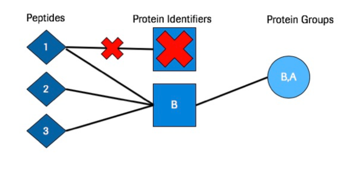

# Py Protein Inference
## Requirements

 1. __Python 3.6__ or greater. This package was created using __Python 3.6__
 2. __Python Packages__:
	__numpy__, __pandas__, __pyteomics__, __biopython__, __pulp__, __PyYAML__. These should be installed automatically during installation.
		

## Installation
1. Use Pip:
```pip install protein_inference```
2. Cloning the Repository:
```git clone repo_url``` - Replace repo_url with the proper URL for the package.
```cd repo``` - Replace repo with the name of the directory that protein inference was put into. Should be ```protein_inference```
within the above directory type: ```python setup.py install```

After either of these two steps above the package should be installed


## Introduction
Py Protein Inference is an independent Python package that has the ability to run various protein inference algorithms on tandem mass spectrometry search results. In addition to performing protein inference which maps peptides to proteins, this algorithm creates protein scores based on the supplied peptides and is able to calculate set based protein level false discovery rates for MS data filtering purposes. Py Protein Inference typically takes as input the output PSM files from the [Percolator algorithm](https://github.com/percolator/percolator). However, Py Protein Inference can also take custom tab delimited files as input. As for output Py Protein Inference generates a user friendly tab delimited format that includes the Proteins, Peptides, Q values, and Protein Scores. 

 Py Protein Inference has the ability to run any of the following inference procedures from literature:

 1. Parsimony
 2. Exclusion
 3. Inclusion
 4. Peptide Centric (Protein Group Level)
 5. No Inference (Selects first protein per peptide)
 
 Please see the [__Inference Types__](#inference-types) section for more information on Inference Types
 
 In Addition to these inference types Py Protein Inference can also score proteins with a variety of methods:
 
 1.  Best Peptide Per Protein
 2. Multiplicative Log
 3. Top Two Combined
 4. Additive
 5. Iterative Downweighted Log
 6. Downweighted Multiplicative Log
 7. Geometric Mean
 
Please see the [__Score Types__](#score-types) section for more information on scoring algorithms

## Using Py Protein Inference
Please go through each section below. The sections highlight how to set everything up properly to run Py Protein Inference and how to run an analysis with Py Protein Inference.
 1. [Yaml Parameter File](#yaml-parameter-file-outline)
 2. [Input PSM files](#input-file-examples) (Tab Delimited)
 3. [Fasta Database](#fasta-file-example)
 4. [Running Py Protein Inference](#running-py-protein-inference)

# Yaml Parameter File Outline
The Yaml Parameter File is the central location for all configurations for a given Protein Inference run and are summarized below:
For a sample parameter file please see the `parameters/` folder.
## General:
| Parameter | Description |Type|
|---|---|---|
| export | Export Type can be one of: __q_value__, __q_value_all__, __q_value_comma_sep__, __leads__, __all__, __comma_sep__. Standard type is __q_value__ | String |
| fdr | False Discovery Rate to be marked as significant. Ex. __0.01__ for 1% FDR | Numeric |
| picker | __True__/__False__ on whether to run the Protein Picker algorithm. For more info click [here](#protein-picker) | Bool |
| tag | A String tag that will be written into the result files. Ex. __example_tag__ | String |

## Data Restriction:
| Parameter | Description |Type|
|---|---|---|
| pep_restriction | Posterior Error Probability values to filter. IE __0.9__. In this case PSMs with PEP values greater than __0.9__ would be removed from the input. If PEP values not in input please use __None__  | Numeric |
| peptide_length_restriction | Peptide Length to filter on. IE __7__. If no filter wanted please use __None__ | Int |
| q_value_restriction | Q Values to filter. IE __0.2__. In this case PSMs with Q Values greater than __0.2__ would be removed from the input. If Q Values not in input please use __None__  | Numeric |
| custom_restriction | Custom Value to filter. IE __5__. In this case PSMs with Custom value greater than / less than __5__ would be removed from the input. If Not using a custom score please use __None__. __NOTE__: If a higher score is "better" for your score please set __score_type__ to __additive__. If a lower score is "better" please set __score_type__ parameter to __multiplicative__   | Numeric |

## Score:
| Parameter | Description |Type|
|---|---|---|
| score_method | One of any of the following: __multiplicative_log__, __best_peptide_per_protein__, __top_two_combined__, __additive__, __iterative_downweighted_log__, __downweighted_multiplicative_log__, __geometric_mean__. Recommended: __multiplicative_log__ | String |
| score | PSM score to use for Protein Scoring. If using Percolator output as input this would either be __posterior_error_prob__ or __q-value__. The string typed here should match the column in your input files __EXACTLY__. If using a custom score it will be filtered accordingly with the value in [__custom_restriction__](#data-restriction) | String |
| score_type | The Type of score that __score__ parameter is. Either __multiplicative__ or __additive__. See [below](#extra-score-information) for more information| String |
### Extra Score information:

 1. The __score_method__, __score__, and __score_type__ methods must be compatible.
 2. If using a PSM score (__score__ parameter) where the lower the score the better IE (__posterior_error_prob__ or __q-value__) then any  __score_method__ can be used except __additive__. __score_type__ must also be set to __multiplicative__
 3. If using a PSM score (__score__ parameter) where the higher the score the better IE Percolator Score (called __score__ - column name) in the tab delimited percolator output. Then __score_method__ and __score_type__ must both be __additive__

## Identifiers:
| Parameter | Description |Type|
|---|---|---|
| decoy_symbol | Symbol within Decoy Identifiers to distinguish between targets. IE "__##__" or "__decoy___". This is important for Protein [Picker](#protein-picker) and FDR calculation | String |
| isoform_symbol | Symbol that is present in isoform proteins only. IE "__-__". See [below](#extra-identifier-information) for more information | String |
| reviewed_identifier_symbol | Identifier to determine a reviewed vs unreviewed identifier. IE "__sp\|__". See [below](#extra-identifier-information) for more information | String |
### Extra Identifier information:

 1. For the __decoy_symbol__ an example of a target protein -> __ex|protein__ and its decoy counterpart could be any of the following: __##ex|##protein__, __##ex|protein__, __decoy_ex|protein__. The decoy symbol just needs to be present within the string to be determined decoy/target
 2. For __isoform_symbol__ and __reviewed_identifier_symbol__, these are used to assign priority in certain algorithms such as parsimony. For example if we have canonical proteins, isoform proteins, and reviewed/unreviewed proteins in a given analysis the priority would be established as followed: Reviewed Canonical, Reviewed Isoform, Unreviewed. What this means is that if two proteins map to the same peptides the algorithm has to make a decision on which to pick. It would use the previous mentioned priority to pick the protein lead to report. 

## Inference:
| Parameter | Description |Type|
|---|---|---|
| inference_type | The Inference procedure to apply to the analysis. This can be __parsimony__, __inclusion__, __exclusion__, __peptide_centric__, or __None__. Please see [here](#inference-types) for more information on the inference types.  | String |
| grouping_type | How to group proteins for a given __inference_type__. This can be __subset_peptides__,  __shared_peptides__, or __None__. Typically __subset_peptides__ is used. This parameter only effects grouped proteins and has no impact on protein leads. | String |

## Digest:
| Parameter | Description |Type|
|---|---|---|
| digest_type | The enzyme used for digestion for the MS searches. Can be either __trypsin__ or __lysc__. Other digest types can be implemented upon request | String |
| missed_cleavages | The number of missed cleavages allowed for the MS searches. IE __2__ | Int |

## Parsimony:
These parameters are only used if __parsimony__ is selected as __inference_type__

| Parameter | Description |Type|
|---|---|---|
| lp_solver | This can be one of: __pulp__, __glpk__, __None__. This determines which linear program solver is used. Please see [here](#parsimony-dependancies) for more information on lp solvers. Both options have external dependency requirements. Input __None__ if not running __parsimony__ | String |
| glpk_path | If glpk is selected as __lp_solver__ input the path to the commandline tool __glpsol__. This is typically just __glpsol__ | String |

## Peptide Centric:
These parameters are only used if __peptide_centric__ is selected as 

| Parameter | Description | Type |
|---|---|---|
| max_identifiers | The maximum number of proteins a peptide is allowed to map to. IE __5__. This serves to limit the number of protein groups that can be created due to highly homologous peptides. | Int |

# Input File Examples
As previously mentioned the standard input filetype is the tab delimited output from the percolator algorithm. Please see below for examples of input files:
### Standard Percolator Output as Input
| PSMid | score | q-value | posterior_error_prob | peptide | proteinIds |  |  |  |
|---|---|---|---|---|---|---|---|---|
| 1.1 | 7.5 | 0.0048 | 0.0007 | R.NYIQSLTQMPK.M | MK14_HUMAN\|Q16539 | MK14_HUMAN\|Q16539-2 | MK14_HUMAN\|Q16539-3 |  |
| 1.2 | 6.2 | 0.0035 | 0.0006 | R.NTVASSSRSM*R.T | FHDC1_HUMAN\|Q9C0D6 |  |  |  |
With the above standard input one could use __q-value__ or __posterior_error_prob__ as the PSM score see [Score Section](#score) with __multiplicative__ as __score_type__ and any of the multiplicative options for __score_method__. Also, one could use __score__ as the PSM __score__ with __additive__ as the __score_type__ and __score_method__

For example standard input files please see any of the following:
`tests/data/test_perc_data_target.txt`
`tests/data/test_perc_data_decoy.txt`

### Custom Input
| PSMid | custom_score | peptide | proteinIds |  | 
|---|---|---|---|---|
| 1.1 | 7.5 | R.NYIQSLTQMPK.M | MK14_HUMAN\|Q16539 | MK14_HUMAN\|Q16539-2 | MK14_HUMAN\|Q16539-3 |  |
| 1.2 | 6.2 |  R.NTVASSSRSM*R.T | FHDC1_HUMAN\|Q9C0D6 |  |  | 
With the above custom input one could use one could use __custom_score__ as the PSM __score__ with __additive__ as the __score_type__ and __score_method__

For example custom input files please see any of the following:
`tests/data/test_perc_data_target_additive.txt`
`tests/data/test_perc_data_decoy_additive.txt`
`tests/data/test_perc_data_target_multiplicative.txt`
`tests/data/test_perc_data_decoy_multiplicative.txt`

# Fasta File Example
This package was developed using standard fasta files from [Uniprot](https://www.uniprot.org/).
Please see an example entry in a fasta database below:
```
>H2B2F_HUMAN|Q5QNW6-2 sp|H2B2F_HUMAN|Q5QNW6-2 Isoform 2 of Histone H2B type 2-F OS=Homo sapiens GN=HIST2H2BF
MPDPAKSAPAPKKGSKKAVTKVQKKDGKKRKRSRKESYSVYVYKVLKQVHPDTGISSKAM
GIMNSFVNDIFERIAGEASRLAHYNKRSTITSREIQTAVRLLLPGELAKHAVSEGTKAVT
KYTSSKLIGPILWK
```
Please see `tests/data/test_database.fasta` for an example fasta database file.

# Running Py Protein Inference
There are two ways to run Py Protein Inference:

 1. [__Command Line__](#running-via-command-line)
 2. [__Within Python__](#running-within-python)
### Running Via Command Line
Upon proper installation of the package, the command line tool should be installed and _should_ be available from any location on the system.
The command line tool can be called as follows:
`Command_Line_PI_runner_Yaml.py --help`
This will return the help prompt for the tool.
If this does not work download `Command_Line_PI_runner_Yaml.py` and write the full path to the script while also calling `python`
`python /path/to/directory/protein_inference/scripts/Command_Line_PI_runner_Yaml.py --help`

Command line options are as follows:
```
-h, --help  show this help message and exit

-t FILE, --target FILE
Input target psm output from percolator

-d FILE, --decoy FILE
Input decoy psm output from percolator

-o FILE, --output FILE
protein_inference Result Directory to write to - Name
of file will be determined by parameters selected and
searchID

-db FILE, --database FILE
Provide the database used in the MS search

-ym FILE, --yaml_params FILE
Provide a Protein Inference Yaml Parameter File... If
none given, default parameters will be ran
```

If this works then you are ready to run the protein inference tool on your data.
You can run the tool as follows:
`Command_Line_PI_runner_Yaml.py -t /path/to/target/file.txt -d /path/to/decoy/file.txt -db /path/to/database/file.fasta -ym /path/to/parameter/file.yaml -o /path/to/output/directory/`

### Running Within Python
To run within a python console please see the following example:
```python
from protein_inference.pipeline import ProteinInferencePipeline

yaml_params = "/path/to/yaml/params.yaml"
database = "/path/to/database/file.fasta"
### target_files can either be a list of files or one file
target_files = ["/path/to/target1.txt","/path/to/target2.txt"]
### decoy_files can either be a list of files or one file
decoy_files = ["/path/to/decoy1.txt","/path/to/decoy2.txt"]
output_directory_name = "/path/to/output/directory/"

pipeline = ProteinInferencePipeline(parameter_file=yaml_params,
									database_file=database,  
                                    target_files=target_files,  
                                    decoy_files=decoy_files,  
                                    files=None,  
                                    output_directory=output_directory_name)  
# Calling .execute() will initiate the pipeline with the given data                                                               
pipeline.execute()
```

# Extra Information
## Inference Types
### Inclusion Notes
Inclusion simply maps all peptides to all possible proteins. In this model we allow peptides to map to multiple proteins.

### Parsimony Notes
Parsimony is the process of taking the list of peptides and mapping them to the minimal set of protein identifiers avaliable. 

### Exclusion Notes
Exclusion maps all peptides to all possible proteins but removes any peptide from the search that is not distinguishing. This means that if a peptide maps to more than one protein it will be removed. With this inference model the database selection is very important. Ideally the database selected for searches should have limited redundancy.

### Peptide Centric Notes
For Peptide Centric inference all peptides are assigned to all possible proteins. Each peptide is then assigned a protein group based on the mentioned possible protein map. For protein group naming, the possible proteins for the peptides in the group are concatenated to a list separated by a semi-colon. 

## Parsimony Dependancies 
Parsimony currently has potential external dependancies depending on the __lp_solver__ that is selected in the parameter file.

 1. For __Pulp__:
	 Pulp _should_ automatically install the LP Solver CBC by default.
	 However, For troubleshooting please see [Pulp](https://pypi.org/project/PuLP/) documentation.
	 If Pulp is not working it is likely due to the linear program [CBC](https://github.com/coin-or/Cbc) not being installed.
	 Please follow the instructions for installing [CBC](https://github.com/coin-or/Cbc)
 2. For __Glpk__:
	 Mac: `brew install glpk` - Try to install with [Homebrew](https://brew.sh/)
	 Windows: Check [here](http://winglpk.sourceforge.net/)
	 Linux: Check [here](https://en.wikibooks.org/wiki/GLPK/Linux_packages)
	 Other: Check the main [GLPK website](https://www.gnu.org/software/glpk/)
	 Anaconda: [Anaconda](https://anaconda.org/conda-forge/glpk) also offers an installation
## Protein Picker
[Protein Picker](https://www.ncbi.nlm.nih.gov/pubmed/25987413) is an algorithm that treats target and decoy proteins as pairs and is essentially target/decoy competition. If both the target and decoy proteins are identified from the searches when protein picker is ran the target and decoy scores are compared with one another. The one with the larger score is kept to continue on in the analysis while the one with the lower score gets filtered out of the analysis. This algorithm is integrated into other tools such as [Percolator Protein Inference](https://www.ncbi.nlm.nih.gov/pubmed/27572102)
## Score Types
|Score Type| Description |
|---|---|
| Best Peptide Per Protein | Uses the best scoring PSM as the overall score for a given protein |
| Multiplicative Log | Multiplies all of the PSM scores together and then takes the log of the value (This only works for scores where lower is better) |
| Top Two Combined | Takes the two best scoring peptides and applies Multiplicative Log to them to get the protein score |
| Additive | Adds all of the PSM scores together (This only works for scores where higher is better) |
| Downweighted Multiplicative Log | Multiplicative Log but normalizes by the number of PSMs per protein. This method attempts to normalize small and large proteins. In a typical multiplicative log a larger protein would have an advantage at having a higher score than a small protein |
| Geometric Mean | Takes the geometric mean of the PSMs per protein |

