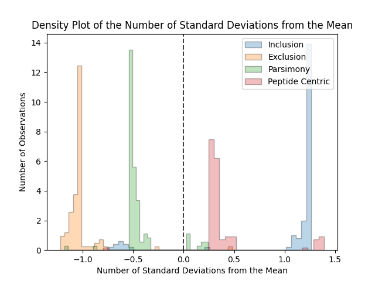

## Running Py Protein Inference
 1. [__Main Inference Method__](#running-the-main-py-protein-inference-method)
 2. [__Heuristic__](#running-the-heuristic-method)

### Running the Main Py Protein Inference Method

#### Running Via Command Line
Upon proper installation of the package, the command line tool should be installed and _should_ be available from any location on the system.
The command line tool can be called as follows:
```shell
protein_inference_cli.py --help
```
This will return the help prompt for the tool.
If this does not work download `protein_inference_cli.py` from our repository and write the full path to the script while also calling `python`:
```shell
python /path/to/directory/pyproteininference/scripts/protein_inference_cli.py --help
```

Command line options are as follows:
```
cli$ python protein_inference_cli.py --help
usage: protein_inference_cli.py [-h] [-t FILE [FILE ...]] [-d FILE [FILE ...]]
                                [-f FILE [FILE ...]] [-o DIR] [-l FILE]
                                [-a DIR] [-b DIR] [-c DIR] [-db FILE]
                                [-y FILE] [-p] [-i]

Protein Inference

optional arguments:
  -h, --help            show this help message and exit
  -t FILE [FILE ...], --target FILE [FILE ...]
                        Input target psm output from percolator. Can either
                        input one file or a list of files.
  -d FILE [FILE ...], --decoy FILE [FILE ...]
                        Input decoy psm output from percolator. Can either
                        input one file or a list of files.
  -f FILE [FILE ...], --combined_files FILE [FILE ...]
                        Input combined psm output from percolator. This should
                        contain Target and Decoy PSMS. Can either input one
                        file or a list of files.
  -o DIR, --output DIR  Result Directory to write to - the name of file will
                        be determined by parameters selected and tag
                        parameter. If this option is not set, will write
                        results to current working directory.
  -l FILE, --output_filename FILE
                        Filename to write results to. Can be left blank. If
                        this flag is left blank the filename will be
                        automatically generated. If set this flag will
                        override -o.
  -a DIR, --target_directory DIR
                        Directory that contains either .txt or .tsv input
                        target psm data. Make sure the directory ONLY contains
                        result files.
  -b DIR, --decoy_directory DIR
                        Directory that contains either .txt or .tsv input
                        decoy psm data. Make sure the directory ONLY contains
                        result files.
  -c DIR, --combined_directory DIR
                        Directory that contains either .txt or .tsv input data
                        with targets/decoys combined. Make sure the directory
                        ONLY contains result files.
  -db FILE, --database FILE
                        Path to the fasta formatted database used in the MS
                        search. This is optional. If not set, will use the
                        proteins only in the input files.
  -y FILE, --yaml_params FILE
                        Path to a Protein Inference Yaml Parameter File. If
                        this is not set, default parameters will be used.
  -p, --skip_append_alt
                        Advanced usage only. If this flag is set, will skip
                        adding alternative proteins to each PSM from the
                        database digest. If this flag is not set, the
                        peptide/protein mapping will be taken from database
                        digest and appended to the mapping present in the
                        input files.
  -i, --id_splitting    Advanced usage only. If set this flag will split
                        protein identifiers.If not set, this flag will not
                        split protein identifiers.Sometimes the fasta database
                        protein IDs are formatted as: 'sp|ARAF_HUMAN|P10398'.
                        While protein IDs in the input files are formatted as
                        'ARAF_HUMAN|P10398'. Setting This flag will split off
                        the front 'sp|' or 'tr|' from the database protein
                        identifiers.

```

The following combinations of input are allowed and at least one combination is required:

1. `-t -d` Path to input target (`-t`) and decoy (`-d`) files. This can be one target and one decoy file or multiple files separated by spaces (" "). See [here](input_format.md#standard-percolator-output) for information on target/decoy input files.
2. `-a -b` Path to input target (`-a`) and decoy (`-b`) directories that contain target and decoy files. This is one directory each and all .txt and .tsv files will be read in as input.
3. `-f` Path to input combined target/decoy (`-f`) files. This can be one file or multiple files separated by spaces (" ").
4. `-c` Path to input combined target/decoy (`-c`) directory that contain combined target/decoy files. This is one directory each and all .txt and .tsv files will be read in as input.

Any other combinations will result in an Error raised.

Optional flags

1. `-db` Path to Fasta Database file.
2. `-y` Path to Protein Inference Yaml Parameter file. (If this is not supplied default parameters will be used).
3. `-o` Path to the output directory, if this is left blank files will be written to the current working directory.
4. `-l` Path to the output filename, if this is left blank a filename will be automatically generated and will be written to directory as set in `-o`. Will override `-o` flag if set.

Advanced usage flags

1. `-p` This flag is a True/False on whether to skip appending alternative proteins from the Fasta database digestion. If this flag is left blank, it will not skip appending alternative proteins (recommended). 
2. `-i` True/False on whether to split the IDs in the Fasta database file. If this is left blank, it will not split IDs in the Fasta database file (recommended).

You can run the tool as follows:
```shell
protein_inference_cli.py \
    -t /path/to/target/file.txt \
    -d /path/to/decoy/file.txt \
    -db /path/to/database/file.fasta \
    -y /path/to/parameter/file.yaml \
    -o /path/to/output/directory/
```

Running with multiple input target/decoy files:
```shell
protein_inference_cli.py \
    -t /path/to/target/file1.txt /path/to/target/file2.txt \
    -d /path/to/decoy/file1.txt /path/to/decoy/file2.txt \
    -db /path/to/database/file.fasta \
    -y /path/to/parameter/file.yaml \
    -o /path/to/output/directory/
```


#### Running Within Python
To run within a python console please see the following example:
```python
from pyproteininference.pipeline import ProteinInferencePipeline

yaml_params = "/path/to/yaml/params.yaml"
database = "/path/to/database/file.fasta"
### target_files can either be a list of files or one file
target_files = ["/path/to/target1.txt","/path/to/target2.txt"]
### decoy_files can either be a list of files or one file
decoy_files = ["/path/to/decoy1.txt","/path/to/decoy2.txt"]
output_directory_name = "/path/to/output/directory/"

pipeline = ProteinInferencePipeline(parameter_file=yaml_params,
									database_file=database,  
                                    target_files=target_files,  
                                    decoy_files=decoy_files,  
                                    combined_files=None,  
                                    output_directory=output_directory_name)  
# Calling .execute() will initiate the pipeline with the given data                                                               
pipeline.execute()
```

### Running the Heuristic Method
Py Protein Inference also has a built-in Heuristic that runs through four inference methods (Inclusion, Exclusion, Parsimony, and Peptide Centric) and selects a recommended method for your given dataset. 
By default, all four result files will be written, and the optimal method will be highlighted to the user.
The Heuristic method also outputs a density plot that showcases all the inference methods compared to one another to gain further insight. For more information on the Heuristic Method see the [__Heuristic algorithm__](supplementary.md#heuristic-algorithm) section.

#### Running the Heuristic Method via the Command Line
```shell
python protein_inference_heuristic_cli.py --help
```
This will return the help prompt for the tool.
If this does not work download `protein_inference_heuristic_cli.py` from the repository and write the full path to the script while also calling `python`.
```shell
python /path/to/directory/pyproteininference/scripts/protein_inference_heuristic_cli.py --help
```

Command line options are as follows:
```
cli$ python protein_inference_heuristic_cli.py --help
usage: protein_inference_heuristic_cli.py [-h] [-t FILE [FILE ...]]
                                          [-d FILE [FILE ...]]
                                          [-f FILE [FILE ...]] [-o DIR]
                                          [-l FILE] [-a DIR] [-b DIR] [-c DIR]
                                          [-db FILE] [-y FILE] [-p] [-i]
                                          [-r FILE] [-m FLOAT] [-u STR]

Protein Inference Heuristic

optional arguments:
  -h, --help            show this help message and exit
  -t FILE [FILE ...], --target FILE [FILE ...]
                        Input target psm output from percolator. Can either
                        input one file or a list of files.
  -d FILE [FILE ...], --decoy FILE [FILE ...]
                        Input decoy psm output from percolator. Can either
                        input one file or a list of files.
  -f FILE [FILE ...], --combined_files FILE [FILE ...]
                        Input combined psm output from percolator. This should
                        contain Target and Decoy PSMS. Can either input one
                        file or a list of files.
  -o DIR, --output DIR  Result Directory to write to - the name of file will
                        be determined by parameters selected and tag
                        parameter. If this option is not set, will write
                        results to current working directory.
  -l FILE, --output_filename FILE
                        Filename to write results to. Can be left blank. If
                        this flag is left blank the filename will be
                        automatically generated. If set this flag will
                        override -o.
  -a DIR, --target_directory DIR
                        Directory that contains either .txt or .tsv input
                        target psm data. Make sure the directory ONLY contains
                        result files.
  -b DIR, --decoy_directory DIR
                        Directory that contains either .txt or .tsv input
                        decoy psm data. Make sure the directory ONLY contains.
                        result files.
  -c DIR, --combined_directory DIR
                        Directory that contains either .txt or .tsv input data
                        with targets/decoys combined. Make sure the directory
                        ONLY contains result files.
  -db FILE, --database FILE
                        Path to the fasta formatted database used in the MS
                        search. This is optional. If not set, will use the
                        proteins only in the input files.
  -y FILE, --yaml_params FILE
                        Path to a Protein Inference Yaml Parameter File. If
                        this is not set, default parameters will be used.
  -p, --skip_append_alt
                        Advanced usage only. If this flag is set, will skip
                        adding alternative proteins to each PSM from the
                        database digest. If this flag is not set, the
                        peptide/protein mapping will be taken from database
                        digest and appended to the mapping present in the
                        input files.
  -i, --id_splitting    Advanced usage only. If set this flag will split
                        protein identifiers.If not set, this flag will not
                        split protein identifiers.Sometimes the fasta database
                        protein IDs are formatted as: 'sp|ARAF_HUMAN|P10398'.
                        While protein IDs in the input files are formatted as
                        'ARAF_HUMAN|P10398'. Setting This flag will split off
                        the front 'sp|' or 'tr|' from the database protein
                        identifiers.
  -r FILE, --pdf_filename FILE
                        PDF Filepath to write the Heuristic plot to after
                        Heuristic Scoring. If not set, writes the file with
                        filename heuristic_plot.pdf to directory set in -o. If -o is
                        not set, will write the file to current working
                        directory.
  -m FLOAT, --fdr_threshold FLOAT
                        The FDR threshold to use in the Heuristic Method.
                        Defaults to 0.05 if not set.
  -u STR, --output_type STR
                        The type of output to be written. Can either be 'all'
                        or 'optimal'. If set to 'all' will output all
                        inference results. If set to 'optimal' will output
                        only the result selected by the heuristic method. If
                        left blank this will default to 'all'.
```

Input options are the same as the standard protein_inference_cli.py with the addition of three optional inputs:
1. `-r` This is a filepath that will have a density plot written to it after the heuristic method has been run. If this is left blank, it will write the plot into the standard output directory with the name heuristic_plot.pdf
2. `-m` The FDR threshold to use in the Heuristic Method. The method will use values from 0 to the FDR threshold. If this value is left blank, it will be set to 0.05
3. `-u` This is the type of output to be written after the heuristic method is complete. Will either output all results or the optimal results. If all is selected, the optimal results will have the string "optimal_method" spliced into the filename.

You can run the tool as follows:
```shell
protein_inference_heuristic_cli.py \
    -t /path/to/target/file.txt \
    -d /path/to/decoy/file.txt \
    -db /path/to/database/file.fasta \
    -y /path/to/parameter/file.yaml \
    -o /path/to/output/directory/ \
    -r /path/to/pdf/file.pdf \
    -m 0.05
```

Running with multiple input target/decoy files:
```shell
protein_inference_heuristic_cli.py \
    -t /path/to/target/file1.txt /path/to/target/file2.txt \
    -d /path/to/decoy/file1.txt /path/to/decoy/file2.txt \
    -db /path/to/database/file.fasta \
    -y /path/to/parameter/file.yaml \
    -o /path/to/output/directory/ \
    -r /path/to/pdf/file.pdf \
    -m 0.05
```


#### Running the Heuristic Method via Python
To run within a python console please see the following example:
```python
from pyproteininference.heuristic import HeuristicPipeline

yaml_params = "/path/to/yaml/params.yaml"
database = "/path/to/database/file.fasta"
### target_files can either be a list of files or one file
target_files = ["/path/to/target1.txt","/path/to/target2.txt"]
### decoy_files can either be a list of files or one file
decoy_files = ["/path/to/decoy1.txt","/path/to/decoy2.txt"]
output_directory_name = "/path/to/output/directory/"
pdf_filename = "/path/to/output/directory/heuristic_plot.pdf"

hp = HeuristicPipeline(parameter_file=yaml_params,
							 database_file=database,  
							 target_files=target_files,  
							 decoy_files=decoy_files,  
							 combined_files=None,  
							 output_directory=output_directory_name,
							 pdf_filename=pdf_filename,
					   		 output_type="all")  
# Calling .execute() will initiate the heuristic pipeline with the given data 
# The suggested method will be output in the console and the suggested method results will be written into the output_directory
hp.execute(fdr_threshold=0.05)

# The optimal inference method and density plot can be generated separately as well with the following to specify thresholds directly:
hp.determine_optimal_inference_method(false_discovery_rate_threshold=0.05,
                                       upper_empirical_threshold=1,
                                       lower_empirical_threshold=.5,
                                       pdf_filename=None)

```

#### Heuristic Output Example

##### Console Output
Console Output is as follows and indicates the recommended method at the end:
```shell
2022-05-12 17:28:38,413 - pyproteininference.heuristic - INFO - Heuristic Scores
2022-05-12 17:28:38,413 - pyproteininference.heuristic - INFO - {'inclusion': 1.2145313335009247, 'exclusion': 1.053616485888155, 'parsimony': 0.5416878942666304, 'peptide_centric': 0.24465822235367252}
2022-05-12 17:28:38,413 - pyproteininference.heuristic - INFO - Either parsimony 0.5416878942666304 or peptide centric 0.24465822235367252 pass empirical threshold 0.5. Selecting the best method of the two.
2022-05-12 17:28:38,413 - pyproteininference.heuristic - INFO - Method peptide_centric selected with the heuristic algorithm
```

##### Heuristic Density Plot Output
Below is an example of a Heuristic Density plot. The plot indicates the distribution of the number of standard deviations 
from the mean (of identified proteins at a specified FDR) for each inference method for a range of FDRs from 0 to the false discovery rate threshold (100 fdrs are incrementally selected in the range [0, fdr threshold])
In general, the closer that the peak of a distribution is to 0 the more likely the associated method is to be selected as the recommended method.
For more information on the specifics of the Heuristic Algorithm see [__Heuristic Algorithm Description__](supplementary.md#heuristic-algorithm-description)


