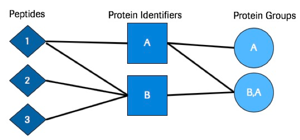
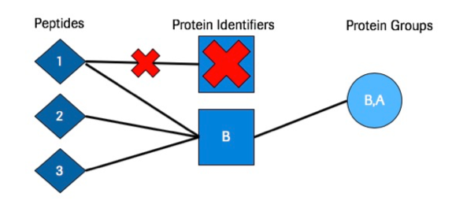
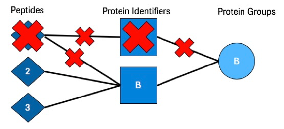
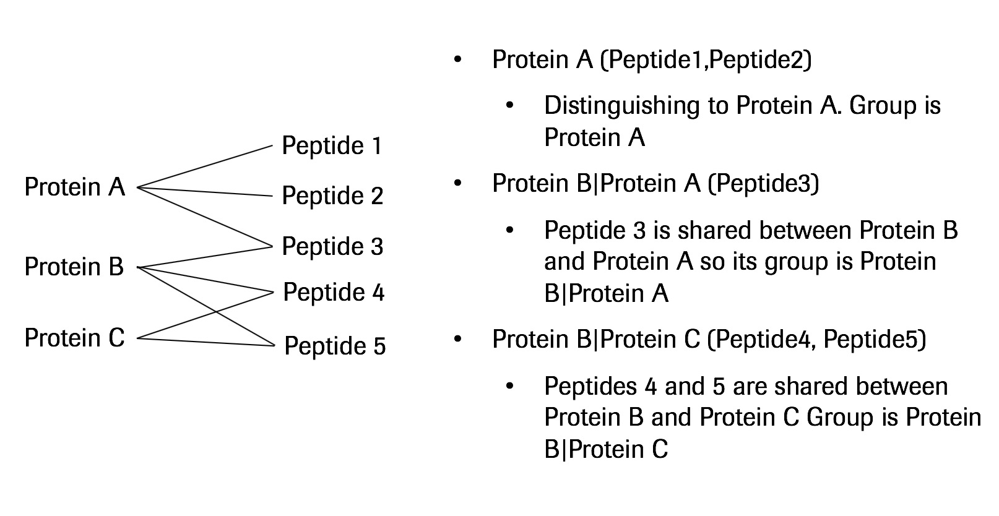

## Supplementary Information

### Heuristic Algorithm

The Heuristic Algorithm contains multiple steps listed below:

The heuristic is a conservative algorithm that attempts to select a method that is not over or under reporting protein IDs based on all four inference methods executed.
Empirical thresholds are set for Parsimony and Peptide Centric (lower threshold) as well as for Inclusion and Exclusion (upper threshold) which helps guide the decision making process for selecting a recommended method. These thresholds are separate for Inclusion and Exclusion because thess two algorithms typically over report Protein IDs (Inclusion) or under report Protein IDs (Exclusion). 

1. First each of the four main inference methods is executed.
2. A finite number (100) of false discovery rates are genereted within the range `[0, fdr_threshold]` by increments of `fdr_threshold * 0.01`. `fdr_threshold` is typically set to `0.05`.
3. We loop over each FDR and the following is done at each specified FDR:
4. The mean of the number of proteins identified at each FDR is calculated across all four methods.
5. The number of standard deviations each method is from the mean at each FDR is calculated.
6. The distribution of the number of standard deviations from the mean is plotted for each method on the same graph. See [Heuristic Plot](advanced.md#heuristic-density-plot-output) for an example.
7. The peak of each distribution (each inference method) is identified and the absolute value of the x-axis coordinate is taken of each value. These are the heuristic scores.
8. A recommended method is selected using the following conditions 
	- If the heuristic score for parsimony and peptide-centric is within 0.5 stdev of zero then both methods are recommended. If only one of the two methods is within 0.5 stdev of zero then that method is selected. If criteria is not met, continue to the next step.
	- If the heuristic score for inclusion and exclusion is within 1 stdev of zero then both methods are recommended. If only one of the two methods is within 1 stdev of zero then that method is selected. (This step is only applicable if step 1 criteria is not met).
	- If neither of these conditions above are met then the method with the heuristic score closest to zero (The least amount of stdev from the mean) is selected as the recommended method.
	
### Inference Types

#### Inclusion

Inclusion simply maps all peptides to all possible proteins. In this model we allow peptides to map to multiple proteins.
This approach is useful if you want to analyze all possible proteins (even those that do not have any distinguishing peptides).

#### Parsimony

Parsimony is the process of taking the list of peptides and mapping them to the minimal set of protein identifiers available. 
This is a standard method that is good at limiting the overall number of proteins but still utilizing all selected peptides.
This method allows shared peptides to map to more than one protein. Assuming that the proteins the peptides get mapped to also contain at least one unique peptide across the searches.

#### Exclusion

Exclusion maps all peptides to all possible proteins but removes any peptide from the search that is not distinguishing. This means that if a peptide maps to more than one protein it will be removed. With this inference model the database selection is very important. Ideally the database selected for searches should have limited redundancy.
The redundancy is computed on the database level, meaning if a peptide maps to more than one protein that is contained in the Fasta database then that peptide will be removed from the analysis entirely.
Exception: If two or more proteins within the database map to the exact same set of digested peptides the algorithm will select the first listed protein and discard the others.

#### Peptide Centric

For Peptide Centric inference all peptides are assigned to all possible proteins. Each peptide is then assigned a protein group based on the mentioned possible protein map. For protein group naming, the possible proteins for the peptides in the group are concatenated to a list separated by a semi-colon. 
This method is useful when there are a lot of shared peptides between multiple proteins. This will create new protein groups based on the shared peptides. This can sometimes more accurately represent the biological state.

#### First Protein

For the First Protein inference method each peptide gets assigned to one protein only. The protein that gets assigned to each peptide is the first listed protein. This is typically the first protein listed in the Fasta database file.
This method is very simplistic but useful if you just want a quick way to get a sense of the protein FDR and are not worried as much about the peptide to protein mapping.

### Protein Picker

[Protein Picker](https://www.ncbi.nlm.nih.gov/pubmed/25987413) is an algorithm that treats target and decoy proteins as pairs and is essentially target/decoy competition. If both the target and decoy proteins are identified from the searches when protein picker is run, then the target and decoy scores are compared with one another. The one with the better score is kept to continue on in the analysis while the one with the worse score gets filtered out of the analysis. This algorithm is integrated into other tools such as [Percolator Protein Inference](https://www.ncbi.nlm.nih.gov/pubmed/27572102).

### Protein Score Types

|Score Type| Description |
|---|---|
| Best Peptide Per Protein | Uses the best scoring PSM as the overall score for a given protein. This can be beneficial to use when proteins of interest map to few peptides. |
| Multiplicative Log | Multiplies all of the PSM scores together and then takes the log of the value (This only works for psm scores where lower is better). |
| Top Two Combined | Takes the two best scoring peptides and applies Multiplicative Log to them to get the protein score. |
| Additive | Adds all of the PSM scores together (This only works for scores where higher is better). |
| Downweighted Multiplicative Log | Multiplicative Log but normalizes by the number of PSMs per protein. This method attempts to normalize small and large proteins. In a typical multiplicative log a larger protein would have an advantage at having a higher score than a small protein. |
| Geometric Mean | Takes the geometric mean of the PSMs per protein. |

### Export Types

It is advised to use the Standard Export Types OR __q_value__

#### Standard Export Types

All standard export types report back protein leads if there is protein sub-setting from the specific tool. (Parsimony can provide protein subsets but in these export types we only choose to report the group lead).
The tables below represent what the output of each export type will look like. Exports are all in CSV format.

- __peptide__: This is a standard export type that reports back Protein, Score, Qvalue, and Peptide sequences in a square format. By default, peptide sequences are separated by a space " ".

| Protein                 | Score              | Q_Value            | Number_of_Peptides | Identifier_Type | GroupID | Peptides                                                                                                                                                      | 
|-------------------------|--------------------|--------------------|--------------------|-----------------|---------|---------------------------------------------------------------------------------------------------------------------------------------------------------------| 
| RPOC_SHIF8\|Q0SY12      | 82.89306334778564  | 0.0                | 12                 | Reviewed        | 1       | CGVEVTQTK EGLNVLQY#FISTHGAR FATSDLNDLYR IALASPDMIR IPQESGGTK LIPAGTGYAYHQDR MGAEAIQALLK NTLLHEQWCDLLEENSVDAVK RVDYSGR VADLFEAR VIDIWAAANDR VTAEDVLKPGTADILVPR | 
| RAF1_HUMAN\|P04049      | 70.7434325345954   | 0.0                | 6                  | Reviewed        | 2       | CQTCGYKFHEHCSTK FQMFQLIDIAR QTAQGMDYLHAK SASEPSLHR VFLPNKQR WHGDVAVKILK                                                                                       | 
| ARAF_HUMAN\|P10398      | 46.288402190472596 | 0.0                | 4                  | Reviewed        | 3       | GYLSPDLSK QTAQGMDYLHAK SASEPSLHR TFFSLAFCDFCLK                                                                                                                | 
| TCAF1_HUMAN\|Q9Y4C2     | 19.048939464610452 | 0.0                | 2                  | Reviewed        | 4       | LYLLTQMPH YCWMSTGLYIPGR                                                                                                                                       | 
| HNRPU_HUMAN\|Q00839     | 15.316094065486292 | 0.0                | 2                  | Reviewed        | 5       | AEGGGGGGRPGAPAAGDGK LQAALDDEEAGGRPAMEPGNGSLDLGGDSAGR                                                                                                          | 
| ##TCAF2_HUMAN\|##A6NFQ2 | 2.4079456086518722 | 0.3333333333333333 | 1                  | Reviewed        | 6       | MEPTPVPFCGAK                                                                                                                                                  | 

- __psms__: This is a standard export type that reports back Protein, Score, Qvalue, and PSMs in a square format. By default, PSMs are separated by a space " ".

| Protein                 | Score              | Q_Value            | Number_of_Peptides | Identifier_Type | GroupID | Peptides                                                                                                                                                      | 
|-------------------------|--------------------|--------------------|--------------------|-----------------|---------|---------------------------------------------------------------------------------------------------------------------------------------------------------------| 
| RPOC_SHIF8\|Q0SY12      | 82.89306334778564  | 0.0                | 12                 | Reviewed        | 1       | CGVEVTQTK EGLNVLQY#FISTHGAR FATSDLNDLYR IALASPDMIR IPQESGGTK LIPAGTGYAYHQDR MGAEAIQALLK NTLLHEQWCDLLEENSVDAVK RVDYSGR VADLFEAR VIDIWAAANDR VTAEDVLKPGTADILVPR | 
| RAF1_HUMAN\|P04049      | 70.7434325345954   | 0.0                | 6                  | Reviewed        | 2       | CQTCGYKFHEHCSTK FQMFQLIDIAR QTAQGMDYLHAK SASEPSLHR VFLPNKQR WHGDVAVKILK                                                                                       | 
| ARAF_HUMAN\|P10398      | 46.288402190472596 | 0.0                | 4                  | Reviewed        | 3       | GYLSPDLSK QTAQGMDYLHAK SASEPSLHR TFFSLAFCDFCLK                                                                                                                | 
| TCAF1_HUMAN\|Q9Y4C2     | 19.048939464610452 | 0.0                | 2                  | Reviewed        | 4       | LYLLTQMPH YCWMSTGLYIPGR                                                                                                                                       | 
| HNRPU_HUMAN\|Q00839     | 15.316094065486292 | 0.0                | 2                  | Reviewed        | 5       | AEGGGGGGRPGAPAAGDGK LQAALDDEEAGGRPAMEPGNGSLDLGGDSAGR                                                                                                          | 
| ##TCAF2_HUMAN\|##A6NFQ2 | 2.4079456086518722 | 0.3333333333333333 | 1                  | Reviewed        | 6       | MEPTPVPFCGAK                                                                                                                                                  | 

- __psm_ids__: This is a standard export type that reports back Protein, Score, Qvalue, and PSM Identifiers in a square format. By default, PSM IDs are separated by a space " ". Values in Peptides column will be the `PSMid` values from data input.

| Protein                 | Score              | Q_Value            | Number_of_Peptides | Identifier_Type | GroupID | Peptides                            | 
|-------------------------|--------------------|--------------------|--------------------|-----------------|---------|-------------------------------------| 
| RPOC_SHIF8\|Q0SY12      | 82.89306334778564  | 0.0                | 12                 | Reviewed        | 1       | 13 14 15 16 17 18 19 20 21 22 23 24 | 
| RAF1_HUMAN\|P04049      | 70.7434325345954   | 0.0                | 6                  | Reviewed        | 2       | 1 2 3 4 5 8                         | 
| ARAF_HUMAN\|P10398      | 46.288402190472596 | 0.0                | 4                  | Reviewed        | 3       | 3 4 6 7                             | 
| TCAF1_HUMAN\|Q9Y4C2     | 19.048939464610452 | 0.0                | 2                  | Reviewed        | 4       | 10 9                                | 
| HNRPU_HUMAN\|Q00839     | 15.316094065486292 | 0.0                | 2                  | Reviewed        | 5       | 11 12                               | 
| ##TCAF2_HUMAN\|##A6NFQ2 | 2.4079456086518722 | 0.3333333333333333 | 1                  | Reviewed        | 6       | 27                                  | 

- __long__: This is a standard export type that reports back Protein, Score, Qvalue, and PSM Identifiers in a long format. Each Peptide for each Protein is listed down the file This format is good for merging to exterior data to swap with the inference reference.

| Protein                | Score              | Q_Value            | Number_of_Peptides | Identifier_Type | GroupID | Peptides                         |
|------------------------|--------------------|--------------------|--------------------|-----------------|---------|----------------------------------|
| RPOC_SHIF8\|Q0SY12      | 82.89306334778564  | 0.0                | 12                 | Reviewed        | 1       | CGVEVTQTK                        |
| RPOC_SHIF8\|Q0SY12      | 82.89306334778564  | 0.0                | 12                 | Reviewed        | 1       | MGAEAIQALLK                      |
| RPOC_SHIF8\|Q0SY12      | 82.89306334778564  | 0.0                | 12                 | Reviewed        | 1       | NTLLHEQWCDLLEENSVDAVK            |
| RPOC_SHIF8\|Q0SY12      | 82.89306334778564  | 0.0                | 12                 | Reviewed        | 1       | RVDYSGR                          |
| RPOC_SHIF8\|Q0SY12      | 82.89306334778564  | 0.0                | 12                 | Reviewed        | 1       | FATSDLNDLYR                      |
| RPOC_SHIF8\|Q0SY12      | 82.89306334778564  | 0.0                | 12                 | Reviewed        | 1       | EGLNVLQY#FISTHGAR                |
| RPOC_SHIF8\|Q0SY12      | 82.89306334778564  | 0.0                | 12                 | Reviewed        | 1       | LIPAGTGYAYHQDR                   |
| RPOC_SHIF8\|Q0SY12      | 82.89306334778564  | 0.0                | 12                 | Reviewed        | 1       | VADLFEAR                         |
| RPOC_SHIF8\|Q0SY12      | 82.89306334778564  | 0.0                | 12                 | Reviewed        | 1       | IPQESGGTK                        |
| RPOC_SHIF8\|Q0SY12      | 82.89306334778564  | 0.0                | 12                 | Reviewed        | 1       | IALASPDMIR                       |
| RPOC_SHIF8\|Q0SY12      | 82.89306334778564  | 0.0                | 12                 | Reviewed        | 1       | VTAEDVLKPGTADILVPR               |
| RPOC_SHIF8\|Q0SY12      | 82.89306334778564  | 0.0                | 12                 | Reviewed        | 1       | VIDIWAAANDR                      |
| RAF1_HUMAN\|P04049      | 70.7434325345954   | 0.0                | 6                  | Reviewed        | 2       | QTAQGMDYLHAK                     |
| RAF1_HUMAN\|P04049      | 70.7434325345954   | 0.0                | 6                  | Reviewed        | 2       | VFLPNKQR                         |
| RAF1_HUMAN\|P04049      | 70.7434325345954   | 0.0                | 6                  | Reviewed        | 2       | FQMFQLIDIAR                      |
| RAF1_HUMAN\|P04049      | 70.7434325345954   | 0.0                | 6                  | Reviewed        | 2       | SASEPSLHR                        |
| RAF1_HUMAN\|P04049      | 70.7434325345954   | 0.0                | 6                  | Reviewed        | 2       | CQTCGYKFHEHCSTK                  |
| RAF1_HUMAN\|P04049      | 70.7434325345954   | 0.0                | 6                  | Reviewed        | 2       | WHGDVAVKILK                      |
| ARAF_HUMAN\|P10398      | 46.288402190472596 | 0.0                | 4                  | Reviewed        | 3       | QTAQGMDYLHAK                     |
| ARAF_HUMAN\|P10398      | 46.288402190472596 | 0.0                | 4                  | Reviewed        | 3       | GYLSPDLSK                        |
| ARAF_HUMAN\|P10398      | 46.288402190472596 | 0.0                | 4                  | Reviewed        | 3       | TFFSLAFCDFCLK                    |
| ARAF_HUMAN\|P10398      | 46.288402190472596 | 0.0                | 4                  | Reviewed        | 3       | SASEPSLHR                        |
| TCAF1_HUMAN\|Q9Y4C2     | 19.048939464610452 | 0.0                | 2                  | Reviewed        | 4       | YCWMSTGLYIPGR                    |
| TCAF1_HUMAN\|Q9Y4C2     | 19.048939464610452 | 0.0                | 2                  | Reviewed        | 4       | LYLLTQMPH                        |
| HNRPU_HUMAN\|Q00839     | 15.316094065486292 | 0.0                | 2                  | Reviewed        | 5       | LQAALDDEEAGGRPAMEPGNGSLDLGGDSAGR |
| HNRPU_HUMAN\|Q00839     | 15.316094065486292 | 0.0                | 2                  | Reviewed        | 5       | AEGGGGGGRPGAPAAGDGK              |
| ##TCAF2_HUMAN\|##A6NFQ2 | 2.4079456086518722 | 0.3333333333333333 | 1                  | Reviewed        | 6       | MEPTPVPFCGAK                     |

#### Legacy Export Types:

All Legacy export types report on the peptide level and can either report protein group leads, or it can report all proteins (Proteins that are subsets of another protein will be reported in these cases for Parsimony).

- __q_value__: This is similar to the __peptide__ export type other than that the peptide sequences reported will be put into a new column. This causes the resulting file to NOT be square.

| Protein                 | Score              | Q_Value            | Number_of_Peptides | Identifier_Type | GroupID | Peptides            |                                  |              |               |           |                |             |                       |         |          |             |                    | 
|-------------------------|--------------------|--------------------|--------------------|-----------------|---------|---------------------|----------------------------------|--------------|---------------|-----------|----------------|-------------|-----------------------|---------|----------|-------------|--------------------| 
| RPOC_SHIF8\|Q0SY12      | 82.89306334778564  | 0.0                | 12                 | Reviewed        | 1       | CGVEVTQTK           | EGLNVLQY#FISTHGAR                | FATSDLNDLYR  | IALASPDMIR    | IPQESGGTK | LIPAGTGYAYHQDR | MGAEAIQALLK | NTLLHEQWCDLLEENSVDAVK | RVDYSGR | VADLFEAR | VIDIWAAANDR | VTAEDVLKPGTADILVPR | 
| RAF1_HUMAN\|P04049      | 70.7434325345954   | 0.0                | 6                  | Reviewed        | 2       | CQTCGYKFHEHCSTK     | FQMFQLIDIAR                      | QTAQGMDYLHAK | SASEPSLHR     | VFLPNKQR  | WHGDVAVKILK    |             |                       |         |          |             |                    | 
| ARAF_HUMAN\|P10398      | 46.288402190472596 | 0.0                | 4                  | Reviewed        | 3       | GYLSPDLSK           | QTAQGMDYLHAK                     | SASEPSLHR    | TFFSLAFCDFCLK |           |                |             |                       |         |          |             |                    | 
| TCAF1_HUMAN\|Q9Y4C2     | 19.048939464610452 | 0.0                | 2                  | Reviewed        | 4       | LYLLTQMPH           | YCWMSTGLYIPGR                    |              |               |           |                |             |                       |         |          |             |                    | 
| HNRPU_HUMAN\|Q00839     | 15.316094065486292 | 0.0                | 2                  | Reviewed        | 5       | AEGGGGGGRPGAPAAGDGK | LQAALDDEEAGGRPAMEPGNGSLDLGGDSAGR |              |               |           |                |             |                       |         |          |             |                    | 
| ##TCAF2_HUMAN\|##A6NFQ2 | 2.4079456086518722 | 0.3333333333333333 | 1                  | Reviewed        | 6       | MEPTPVPFCGAK        |                                  |              |               |           |                |             |                       |         |          |             |                    | 

- __q_value_all__: This is similar to __q_value__ except all proteins will be reported (Not just leads).

| Protein                 | Score              | Q_Value            | Number_of_Peptides | Identifier_Type | GroupID | Peptides                         |                                  |              |               |           |                |             |                       |         |          |             |                    | 
|-------------------------|--------------------|--------------------|--------------------|-----------------|---------|----------------------------------|----------------------------------|--------------|---------------|-----------|----------------|-------------|-----------------------|---------|----------|-------------|--------------------| 
| RPOC_SHIF8\|Q0SY12      | 82.89306334778564  | 0.0                | 12                 | Reviewed        | 1       | CGVEVTQTK                        | EGLNVLQY#FISTHGAR                | FATSDLNDLYR  | IALASPDMIR    | IPQESGGTK | LIPAGTGYAYHQDR | MGAEAIQALLK | NTLLHEQWCDLLEENSVDAVK | RVDYSGR | VADLFEAR | VIDIWAAANDR | VTAEDVLKPGTADILVPR | 
| RAF1_HUMAN\|P04049      | 70.7434325345954   | 0.0                | 6                  | Reviewed        | 2       | CQTCGYKFHEHCSTK                  | FQMFQLIDIAR                      | QTAQGMDYLHAK | SASEPSLHR     | VFLPNKQR  | WHGDVAVKILK    |             |                       |         |          |             |                    | 
| ARAF_HUMAN\|P10398      | 46.288402190472596 | 0.0                | 4                  | Reviewed        | 2       | GYLSPDLSK                        | QTAQGMDYLHAK                     | SASEPSLHR    | TFFSLAFCDFCLK |           |                |             |                       |         |          |             |                    | 
| BRAF_HUMAN\|P15056      | 35.24577101017814  | 0.0                | 3                  | Reviewed        | 2       | GYLSPDLSK                        | QTAQGMDYLHAK                     | VFLPNKQR     |               |           |                |             |                       |         |          |             |                    | 
| ARAF_HUMAN\|P10398      | 46.288402190472596 | 0.0                | 4                  | Reviewed        | 3       | GYLSPDLSK                        | QTAQGMDYLHAK                     | SASEPSLHR    | TFFSLAFCDFCLK |           |                |             |                       |         |          |             |                    | 
| RAF1_HUMAN\|P04049      | 70.7434325345954   | 0.0                | 6                  | Reviewed        | 3       | CQTCGYKFHEHCSTK                  | FQMFQLIDIAR                      | QTAQGMDYLHAK | SASEPSLHR     | VFLPNKQR  | WHGDVAVKILK    |             |                       |         |          |             |                    | 
| BRAF_HUMAN\|P15056      | 35.24577101017814  | 0.0                | 3                  | Reviewed        | 3       | GYLSPDLSK                        | QTAQGMDYLHAK                     | VFLPNKQR     |               |           |                |             |                       |         |          |             |                    | 
| TCAF1_HUMAN\|Q9Y4C2     | 19.048939464610452 | 0.0                | 2                  | Reviewed        | 4       | LYLLTQMPH                        | YCWMSTGLYIPGR                    |              |               |           |                |             |                       |         |          |             |                    | 
| HNRPU_HUMAN\|Q00839     | 15.316094065486292 | 0.0                | 2                  | Reviewed        | 5       | AEGGGGGGRPGAPAAGDGK              | LQAALDDEEAGGRPAMEPGNGSLDLGGDSAGR |              |               |           |                |             |                       |         |          |             |                    | 
| B3KX72_HUMAN\|B3KX72    | 15.316094065486292 | 0.0                | 2                  | Unreviewed      | 5       | AEGGGGGGRPGAPAAGDGK              | LQAALDDEEAGGRPAMEPGNGSLDLGGDSAGR |              |               |           |                |             |                       |         |          |             |                    | 
| Q96BA7_HUMAN\|Q96BA7    | 6.907755278982137  | 0.0                | 1                  | Unreviewed      | 5       | LQAALDDEEAGGRPAMEPGNGSLDLGGDSAGR |                                  |              |               |           |                |             |                       |         |          |             |                    | 
| ##TCAF2_HUMAN\|##A6NFQ2 | 2.4079456086518722 | 0.3333333333333333 | 1                  | Reviewed        | 6       | MEPTPVPFCGAK                     |                                  |              |               |           |                |             |                       |         |          |             |                    | 

- __q_value_comma_sep__: This is similar to __q_value__ except proteins in the group of a lead will be listed in a separate column denoted "Other_Potential_Identifiers". Peptide identifiers are not shown.

| Protein                 | Score              | Q_Value            | Number_of_Peptides | Identifier_Type | GroupID | Other_Potential_Identifiers |                      | 
|-------------------------|--------------------|--------------------|--------------------|-----------------|---------|-----------------------------|----------------------| 
| RPOC_SHIF8\|Q0SY12      | 82.89306334778564  | 0.0                | 12                 | Reviewed        | 1       |                             |                      | 
| RAF1_HUMAN\|P04049      | 70.7434325345954   | 0.0                | 6                  | Reviewed        | 2       | ARAF_HUMAN\|P10398          | BRAF_HUMAN\|P15056   | 
| ARAF_HUMAN\|P10398      | 46.288402190472596 | 0.0                | 4                  | Reviewed        | 3       | RAF1_HUMAN\|P04049          | BRAF_HUMAN\|P15056   | 
| TCAF1_HUMAN\|Q9Y4C2     | 19.048939464610452 | 0.0                | 2                  | Reviewed        | 4       |                             |                      | 
| HNRPU_HUMAN\|Q00839     | 15.316094065486292 | 0.0                | 2                  | Reviewed        | 5       | B3KX72_HUMAN\|B3KX72        | Q96BA7_HUMAN\|Q96BA7 | 
| ##TCAF2_HUMAN\|##A6NFQ2 | 2.4079456086518722 | 0.3333333333333333 | 1                  | Reviewed        | 6       |                             |                      | 

- __leads__: This is similar to __q_value__ except Q values are not reported and only proteins passing the fdr threshold set in the parameters will be reported.

| Protein             | Score              | Number_of_Peptides | Identifier_Type | GroupID | Peptides            |                                  |              |               |           |                |             |                       |         |          |             |                    | 
|---------------------|--------------------|--------------------|-----------------|---------|---------------------|----------------------------------|--------------|---------------|-----------|----------------|-------------|-----------------------|---------|----------|-------------|--------------------| 
| RPOC_SHIF8\|Q0SY12  | 82.89306334778564  | 12                 | Reviewed        | {1}     | CGVEVTQTK           | EGLNVLQY#FISTHGAR                | FATSDLNDLYR  | IALASPDMIR    | IPQESGGTK | LIPAGTGYAYHQDR | MGAEAIQALLK | NTLLHEQWCDLLEENSVDAVK | RVDYSGR | VADLFEAR | VIDIWAAANDR | VTAEDVLKPGTADILVPR | 
| RAF1_HUMAN\|P04049  | 70.7434325345954   | 6                  | Reviewed        | {2, 3}  | CQTCGYKFHEHCSTK    | FQMFQLIDIAR                      | QTAQGMDYLHAK | SASEPSLHR     | VFLPNKQR  | WHGDVAVKILK    |             |                       |         |          |             |                    | 
| ARAF_HUMAN\|P10398  | 46.288402190472596 | 4                  | Reviewed        | {2, 3}  | GYLSPDLSK          | QTAQGMDYLHAK                     | SASEPSLHR    | TFFSLAFCDFCLK |           |                |             |                       |         |          |             |                    | 
| TCAF1_HUMAN\|Q9Y4C2 | 19.048939464610452 | 2                  | Reviewed        | {4}     | LYLLTQMPH           | YCWMSTGLYIPGR                    |              |               |           |                |             |                       |         |          |             |                    | 
| HNRPU_HUMAN\|Q00839 | 15.316094065486292 | 2                  | Reviewed        | {5}     | AEGGGGGGRPGAPAAGDGK | LQAALDDEEAGGRPAMEPGNGSLDLGGDSAGR |              |               |           |                |             |                       |         |          |             |                    | 

- __all__: This is similar to __q_value_all__ except Q values are not reported and only proteins passing the fdr threshold set in the parameters will be reported.
 
| Protein              | Score              | Number_of_Peptides | Identifier_Type | GroupID | Peptides                         |                                  |             |                       |                   |           |                |             |                    |            |         |          | 
|----------------------|--------------------|--------------------|-----------------|---------|----------------------------------|----------------------------------|-------------|-----------------------|-------------------|-----------|----------------|-------------|--------------------|------------|---------|----------| 
| RPOC_SHIF8\|Q0SY12   | 82.89306334778564  | 12                 | Reviewed        | {1}     | FATSDLNDLYR                      | MGAEAIQALLK                      | IPQESGGTK   | NTLLHEQWCDLLEENSVDAVK | EGLNVLQY#FISTHGAR | CGVEVTQTK | LIPAGTGYAYHQDR | VIDIWAAANDR | VTAEDVLKPGTADILVPR | IALASPDMIR | RVDYSGR | VADLFEAR | 
| RAF1_HUMAN\|P04049   | 70.7434325345954   | 6                  | Reviewed        | {2, 3}  | SASEPSLHR                        | FQMFQLIDIAR                      | WHGDVAVKILK | QTAQGMDYLHAK          | CQTCGYKFHEHCSTK   | VFLPNKQR  |                |             |                    |            |         |          | 
| ARAF_HUMAN\|P10398   | 46.288402190472596 | 4                  | Reviewed        | {2, 3}  | SASEPSLHR                        | QTAQGMDYLHAK                     | GYLSPDLSK   | TFFSLAFCDFCLK         |                   |           |                |             |                    |            |         |          | 
| BRAF_HUMAN\|P15056   | 35.24577101017814  | 3                  | Reviewed        | {2, 3}  | QTAQGMDYLHAK                     | GYLSPDLSK                        | VFLPNKQR    |                       |                   |           |                |             |                    |            |         |          | 
| ARAF_HUMAN\|P10398   | 46.288402190472596 | 4                  | Reviewed        | {2, 3}  | SASEPSLHR                        | QTAQGMDYLHAK                     | GYLSPDLSK   | TFFSLAFCDFCLK         |                   |           |                |             |                    |            |         |          | 
| RAF1_HUMAN\|P04049   | 70.7434325345954   | 6                  | Reviewed        | {2, 3}  | SASEPSLHR                        | FQMFQLIDIAR                      | WHGDVAVKILK | QTAQGMDYLHAK          | CQTCGYKFHEHCSTK   | VFLPNKQR  |                |             |                    |            |         |          | 
| BRAF_HUMAN\|P15056   | 35.24577101017814  | 3                  | Reviewed        | {2, 3}  | QTAQGMDYLHAK                     | GYLSPDLSK                        | VFLPNKQR    |                       |                   |           |                |             |                    |            |         |          | 
| TCAF1_HUMAN\|Q9Y4C2  | 19.048939464610452 | 2                  | Reviewed        | {4}     | LYLLTQMPH                        | YCWMSTGLYIPGR                    |             |                       |                   |           |                |             |                    |            |         |          | 
| HNRPU_HUMAN\|Q00839  | 15.316094065486292 | 2                  | Reviewed        | {5}     | AEGGGGGGRPGAPAAGDGK              | LQAALDDEEAGGRPAMEPGNGSLDLGGDSAGR |             |                       |                   |           |                |             |                    |            |         |          | 
| B3KX72_HUMAN\|B3KX72 | 15.316094065486292 | 2                  | Unreviewed      | {5}     | AEGGGGGGRPGAPAAGDGK              | LQAALDDEEAGGRPAMEPGNGSLDLGGDSAGR |             |                       |                   |           |                |             |                    |            |         |          | 
| Q96BA7_HUMAN\|Q96BA7 | 6.907755278982137  | 1                  | Unreviewed      | {5}     | LQAALDDEEAGGRPAMEPGNGSLDLGGDSAGR |                                  |             |                       |                   |           |                |             |                    |            |         |          | 

- __comma_sep__: This is similar to __q_value_comma_sep__ except Q values are not reported and only proteins passing the fdr threshold set in the parameters will be reported. Peptide identifiers are not shown.

| Protein             | Score              | Number_of_Peptides | Identifier_Type | GroupID | Other_Potential_Identifiers |                      | 
|---------------------|--------------------|--------------------|-----------------|---------|-----------------------------|----------------------| 
| RPOC_SHIF8\|Q0SY12  | 82.89306334778564  | 12                 | Reviewed        | {1}     |                             |                      | 
| RAF1_HUMAN\|P04049  | 70.7434325345954   | 6                  | Reviewed        | {2, 3}   | ARAF_HUMAN\|P10398         | BRAF_HUMAN\|P15056   | 
| ARAF_HUMAN\|P10398  | 46.288402190472596 | 4                  | Reviewed        | {2, 3}   | RAF1_HUMAN\|P04049         | BRAF_HUMAN\|P15056   | 
| TCAF1_HUMAN\|Q9Y4C2 | 19.048939464610452 | 2                  | Reviewed        | {4}     |                             |                      | 
| HNRPU_HUMAN\|Q00839 | 15.316094065486292 | 2                  | Reviewed        | {5}     | B3KX72_HUMAN\|B3KX72        | Q96BA7_HUMAN\|Q96BA7 | 
